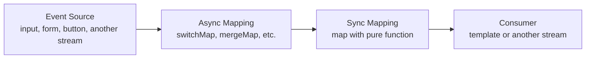
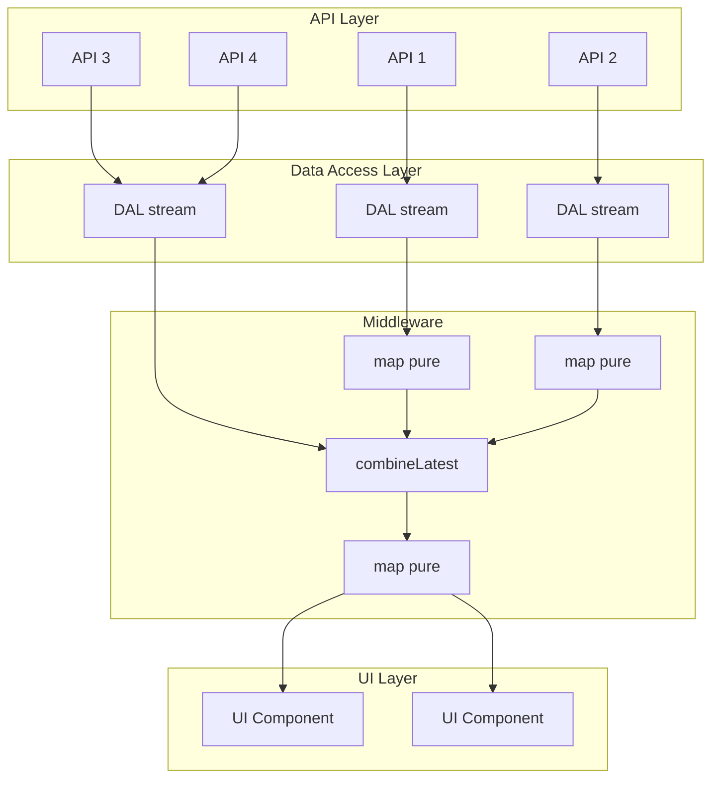
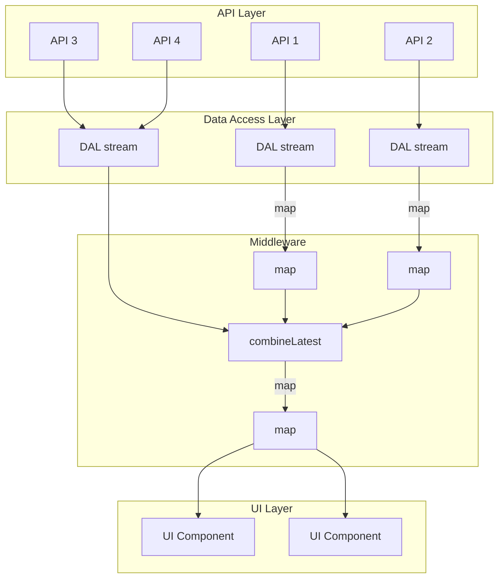

# Functional programming in Angular

## Chapter 1: The Problem with Mutable State in Angular

### Introduction: Why Functional Programming?

Imagine joining a new project. You open the codebase, and this is what greets you:

```typescript
private client!: Client;
private bucket!: Bucket;
private products!: Product[];
public ready = false;
public displayData!: ClientWithBucket;
```

A class of 5000 lines. Fields declared with the `!` assertion, promising TypeScript that they'll be initialized later—but when? Before you can safely read `displayData`, you must trace through the component's lifecycle to discover **when** each field gets its value. Before you write to any field, you must check what reads from it and which dependent methods need to be called afterward.

This is the reality of traditional OOP in Angular. And it comes with a hidden cognitive cost.

### 1.1 The Cognitive Load Problem

Psychologists have discovered that humans can hold only **7±2** distinct contexts in working memory at once. Every mutable variable adds one context. Every read of that variable adds another. Soon, your mental buffer overflows, and your brain starts taking shortcuts—implicit optimizations that lead to assumptions rather than verified facts.

This leads to a dangerous development pattern: _"I'll change this and see what happens."_ The optimistic scenario gets implemented, but edge cases—unusual combinations of permissions or rare entity states—slip through.

What about tests? The monsters that cause production issues are rarely covered by tests. And covering them is incredibly difficult, because many error states arise from sequences of method calls. The code needed to set up the state can be many times larger than the code that actually checks the state.

> _"I'll fix it later if something goes wrong"_

### 1.2 The Core Problem: Implicit Dependencies

The fundamental issue is that dependencies between fields are **implicit**. They exist in time, but they're not expressed in code. You have to hold the entire component lifecycle in your head to understand when data becomes available and how changes propagate.

What we really need is a way to **declaratively describe all dependencies in time**—to make the data flow explicit, visible, and verifiable by the compiler.

### 1.3 The Goal: Compile-Time Error Detection

This brings us to the practical goal of applying functional programming principles in Angular:

> **Using FP principles and TypeScript to catch obviously incorrect code at compile time.**

Why is this so important? Because compile-time errors are the **cheapest** bugs to fix:

- **Compile-time error**: nearly free
- **Unit test failure**: tens of minutes
- **QA finding**: hours
- **Production incident**: days

Compiler time is dramatically cheaper than programmer time—or even AI agent time. And with tools like `tsgo` on the horizon, the compiler is only getting faster and smarter.

> _"You won't have compilation errors without compilation"_

This is the foundation: to leverage the compiler as a bug-detection tool, we must give it enough information to do its job. That means strict typing, explicit contracts, and pure transformations—allowing the compiler to verify that our code is correct before it ever runs.

## Chapter 2: Building a Foundation with Strict Types and Contracts

### 2.1 First Principle: Strict Typing

If you can't enable TypeScript's `strict` mode immediately, at minimum enforce these two rules:

- **No `any` types** – ever
- **Strict null checks** – so `undefined` and `null` must be handled explicitly

These alone eliminate an entire category of runtime errors. But typing is just the beginning—we need to ensure that the data flowing through our application is not just typed, but **correct by construction**.

### 2.2 Second Principle: Contracts

The second pillar of compile-time safety is establishing clear **contracts**—especially between the frontend and backend.

What's the point of using TypeScript if data from the server arrives as "who knows what"?

#### The Approach

Key things to build robust contracts are:

1. **Identify nullable variables** – know what can and cannot be `null`
2. **Define all types explicitly**
   - Use **union types** where appropriate
   - Use **enums** for fixed sets of values
   - **No dynamic types** – if you encounter them, use type guards
3. If your backend uses a strictly typed language – consider yourself lucky

```typescript
type ClientStatus = "active" | "deleted" | "all";

interface Client {
  id: number;
  name: string;
  email: string;
  status: ClientStatus;
  birthDate: string; // ISO date from backend
}
```

### 2.4 Where to Place Contracts

- **Define contracts in a separate layer**
- **API services** should contain only calls to the backend
  - Do not mix business logic with API calls
- The goal is to use TypeScript's type system to prevent:
  - Receiving invalid data
  - Making invalid requests
- Keep data types in the same file as the API service
- Make all entity fields `readonly` where possible using TypeScript utilities

### 2.5 Should You Create Your Own Frontend Models?

**Without significant reasons – no.** The source of truth is on the backend.

Creating your own models introduces unnecessary mappings and additional layers of complexity:

```typescript
// ❌ Avoid when possible
type ClientDto = {
  id: string;
  name: string;
  email: string;
  birth_date: string; // backend format
};

class Client {
  id: string;
  name: string;
  email: string;
  birthDate: Date; // frontend format

  constructor(dto: ClientDto) {
    this.id = dto.id;
    this.name = dto.name;
    this.email = dto.email;
    this.birthDate = new Date(dto.birth_date);
    // ...
  }
}
```

Every mapping is a potential source of bugs and maintenance overhead.

Many articles consider haveing separate model at frontend as good practice. Agrumention it like

#### Expectation

_if contract changes we'll need to update only mapping while keepeing out business logic intact_

#### Reality

- At start we had DTO mapped to Model and used by Consumer
- Then DTO has been changed and instead of `DTO_v2 => Model => Consumer` we got `DTO_v2 => Model_v2 => Consumer_v2` with additional mapping `Model_v2 => Model`
- DTO has been changed again and new chain apeeared `DTO_v3 => Model_v3 => Consumer_v3` with additional mapping `Model_v3 => Model_v2 => Model`

#### A Better Approach: Inversion of Control

If you want to avoid depending on specific backend endpoints, think about it differently—by analogy with the **Dependency Inversion Principle** from SOLID:

- **Before**: Class A depends on Class B
- **After**: Classes A and B both depend on interface IB

Applied to frontend-backend communication:

- **Before**: Frontend depends on specific backend endpoints
- **After**: Both frontend and backend depend on a contract (for example, in OpenAPI format)

The backend returns data according to the contract, and the frontend expects data according to the same contract. This decouples both sides and makes the system more maintainable.

### Summary

In this chapter, we've established the foundation:

1. **Strict typing** with no `any` and null checks enabled
2. **Explicit contracts** between frontend and backend
3. **Separate API layer** with types colocated
4. **Avoid unnecessary frontend models**—trust the backend contract
5. **Use OpenAPI** as a shared contract when possible

## Chapter 3: Pure Functions and Reactive Data Flow

### 3.1 Architecture and System Design

Now that we've established strict typing and contracts, let's look at how data actually flows through an application. The architecture turns out to be **simpler than it seems**.

At its core, the flow is straightforward:

```
Backend Response → UI
```

But between these two points, we need to transform the data into exactly what the UI needs.

### 3.2 It's Simpler Than It Seems

Let's start with the raw material—the types that come from the backend:

```typescript
export type Product = {
  productId: number;
  name: string;
  description: string;
  material: string;
  price: string;
};
```

And we need to transform this raw data into something more useful for our UI. This is where **pure functions** enter the picture:

```typescript
export type PrepareBucketFnc = (
  bucket: Bucket,
  products: Product[],
) => PopulatedBucket;
```

This function signature tells us everything we need to know:

- **Input**: a Bucket and an array of Products
- **Output**: a PopulatedBucket ready for display
- **Pure**: no side effects, no hidden dependencies

### 3.3 What Makes a Function Pure?

A **pure function** has two essential characteristics:

1. **For the same input, it always returns the same output**
2. **It never changes external state**

```typescript
// Pure function example
const prepareBucket = (
  bucket: Bucket,
  products: Product[],
): PopulatedBucket => {
  // transformation logic only
  return {
    ...bucket,
    products: products.map((p) => ({ ...p })),
    total: calculateTotal(products),
  };
};
```

#### Why Purity Matters

The benefits are profound:

- **Cognitive load**: you only need to hold two contexts in your head—input and output
- **Testing**: no side effects to mock or verify, just check the result
- **Caching**: pure functions are trivially memoizable

### 3.4 But Can a Stream Be Pure?

This is a crucial question when working with RxJS in Angular. Streams involve time, asynchronous operations, and external data sources—all of which seem to violate purity at first glance.

Technically, any stream that includes an asynchronous operation—like an HTTP request inside `switchMap`—**cannot be pure** in the strictest sense. Its output depends on network latency, server state, and the exact timing of events. The stream's behavior is not deterministic in the way a pure function's is.

However, in a frontend application, we operate under a necessary assumption: **the backend is our source of truth**. We must trust that the data returned by the backend is correct and that the API contract is honored. Given this trust, we can treat the _content_ of the stream as reliable, even if the _timing_ is not.

### 3.5 Pure Streams? A Pragmatic View

This leads to a pragmatic definition: a stream can be considered **conditionally pure** if:

- All synchronous transformations within the stream are pure functions
- The asynchronous sources are trusted to provide data that conforms to established contracts
- Side effects are isolated and explicitly marked (e.g., with `tap` for logging)

In practice, this means we build our streams as pipelines where the only impure boundaries are at the edges—the API calls themselves—and everything in between is composed of pure transformations.

### 3.6 Complete Data Stream Example

Here's a typical reactive data flow in Angular:

```typescript
private readonly bucket$ = this.clientId$.pipe(
  switchMap((clientId) => this.bucketApi.getClientBucket$(clientId)),
);

private readonly products$ = this.productsApi.allProducts$();

public readonly populatedBucket$ = combineLatest([
  this.bucket$,
  this.products$,
]).pipe(
  map(([bucket, products]) => prepareBucket(bucket, products)),
  shareReplay(1),
);
```

Let's break down what's happening:

1. `bucket$` reacts to changes in `clientId$`, calling the API each time
2. `products$` is a static stream of all products
3. `combineLatest` waits for both streams to emit
4. `map` applies our pure `prepareBucket` function
5. `shareReplay(1)` caches the last result for future subscribers

### Conclusion: The Stream as a Source of Trust

Technically, a stream involving asynchronous operations cannot be pure. But in the context of frontend development, purity is not an end in itself—it's a means to achieve **reliability, maintainability, and compile-time safety**. By trusting the backend as our source of truth and isolating impurities at the edges, we gain a data flow that is:

- **Predictable** – transformations are pure and testable
- **Type-safe** – contracts ensure data shape at every step
- **Composable** – streams can be combined and transformed declaratively
- **Reliable** – the compiler catches mismatches before they reach production

The total stream, while not mathematically pure, becomes a **trustworthy source of data** that we can depend on throughout our application. This pragmatic blend of functional principles with real-world constraints is what makes the approach both practical and powerful.

## Chapter 4: Dirty Common Practices

### 4.1 Let's Talk About Dirty Transformations

Consider this seemingly innocent chain of transformations:

```typescript
const plusOne = (x: number) => x + 1;

initialValue = 0;
one = plusOne(this.initialValue);
two = plusOne(this.one);
three = plusOne(this.two);
```

At first glance, this appears perfectly deterministic. Each value is derived from the previous one through a pure function. The relationship is clear: `three` depends on `two`, which depends on `one`, which depends on `initialValue`.

But appearances can be deceiving.

### 4.2 The Hidden Mutation

The problem becomes apparent when we introduce Angular's lifecycle hooks (or other this.\* mutatations in side-effects):

```typescript
ngOnInit() {
  this.two = 69; // 💥 Breaking the chain!
}
```

Suddenly, our beautiful deterministic chain is broken. `two` no longer equals `plusOne(one)`. It's been arbitrarily reassigned to `69`. And `three`? It still holds `plusOne(two)` based on the _original_ chain, but now `two` has a different value. The relationship is severed, and the code becomes unpredictable.

Is this chain still deterministic? **Absolutely not.** The output now depends on the order of operations—whether `ngOnInit` runs before or after the chain is evaluated—and on the programmer's ability to remember not to mutate derived state.

### 4.3 The Power of `readonly`

TypeScript gives us a simple tool to prevent this entire class of bugs: the `readonly` modifier.

```typescript
readonly initialValue = 0;
readonly one = plusOne(this.initialValue);
readonly two = plusOne(this.one);
readonly three = plusOne(this.two);

ngOnInit() {
  this.two = 69; // ❌ Compile error: cannot assign to readonly property
}
```

Now the compiler stops us from breaking the chain. The error appears at compile time, not runtime. The intent is clear: these values are derived, not meant to be reassigned.

**No `readonly` is a red flag.** If you see a class with derived data that isn't marked `readonly`, assume it's a source of potential bugs until proven otherwise.

### 4.4 The Pure Stream Alternative

The same pattern applies beautifully to RxJS streams:

```typescript
readonly initialValue$ = of(0);
readonly one$ = this.initialValue$.pipe(map(plusOne));
readonly two$ = this.one$.pipe(map(plusOne));
readonly three$ = this.two$.pipe(map(plusOne));

// Or more concisely:
readonly three$ = this.initialValue$.pipe(
  map(plusOne),
  map(plusOne),
  map(plusOne)
);
```

Here, the dependencies are explicit and immutable by nature. Each stream is a read-only declaration of how data flows. There's no way to accidentally mutate `two$`—it's an observable, not a writable property.

### 4.5 The Signal Alternative

With Angular signals, we get similar guarantees through `computed`:

```typescript
readonly initialValue = signal(0);
readonly one = computed(() => plusOne(this.initialValue()));
readonly two = computed(() => plusOne(this.one()));
readonly three = computed(() => plusOne(this.two()));

ngOnInit() {
  this.two.set(69); // ❌ Error: 'set' does not exist on type Signal<number>
}
```

Computed signals are read-only by design. You cannot assign to them—you can only react to their changes.

### 4.6 `linkedSignal`: Use Only When Necessary

Angular 17+ introduces `linkedSignal` for cases where you need a writable signal that stays synchronized with another signal:

```typescript
readonly initialValue = signal(0);
readonly one = linkedSignal(() => plusOne(this.initialValue()));
readonly two = linkedSignal(() => plusOne(this.one()));
readonly three = linkedSignal(() => plusOne(this.two()));
```

Unlike `computed`, `linkedSignal` creates a writable signal. This means you _can_ mutate it:

```typescript
ngOnInit() {
  this.two.set(69); // ⚠️ This is allowed!
}
```

While there are legitimate use cases for `linkedSignal`, it should be used **only when necessary**. By default, prefer `computed` for derived state. Every writable signal is an opportunity for mutation bugs to creep back into your application.

### Conclusion: The Cost of Dirty Practices

The dirty practices we've examined—mutable derived state, assignments in lifecycle hooks, and writable signals used unnecessarily—all share a common problem: they **break the explicit dependency chain** and **increase cognitive load**.

Each mutation adds one more context to keep in your head. Each reassignment creates a potential race condition between when the value should be computed and when it actually gets set. Over time, these small dirtinesses accumulate into an untraceable mess.

The solutions are simple but powerful:

- Mark everything `readonly` by default
- Use pure streams for derived data
- Prefer `computed` over `linkedSignal`
- Let the compiler enforce your intentions

When you see code that violates these principles, treat it as a code smell—a warning that the data flow is no longer reliable and bugs are waiting to happen.

#### RxJS vs. Signals: Choosing the Right Tool

Both RxJS observables and Angular signals have their place in a functional, reactive architecture. Understanding their strengths helps you choose the right tool for each job.

**RxJS Observables: The Universal Solution**

- **Universal data flow tool** – works for everything from API calls to user interactions
- **Pipeable** – the `pipe` method with operators like `map`, `filter`, `switchMap` provides a clean, composable syntax for transformations
- **Lazy by default** – observables are cold until subscribed, enabling powerful patterns like lazy loading for dropdowns, accordions, and other conditional UI
- **Time-aware** – built to handle asynchronous operations, debouncing, throttling, and complex event coordination
- **Cancellable** – subscriptions can be unsubscribed, and operators like `switchMap` cancel pending requests

**Angular Signals: The Final Stage**

- **Synchronous and predictable** – signals provide synchronous access to values, making them ideal for the final stages of a data pipeline
- **Best for loaded data** – due to their synchronous nature, signals should primarily be used when all data is already loaded, such as the final mapping step in a component
- **Fine-grained reactivity** – signals excel at driving Angular's change detection efficiently
- **Limited transformation syntax** – signals lack a built-in pipe/chain syntax; complex transformations are less elegant than RxJS pipelines
- **No lazy loading** – signals are eager by nature, making them unsuitable for scenarios where you want to defer work until needed

**The Pragmatic Approach**

Use RxJS for the heavy lifting: data fetching, transformation pipelines, event coordination, and any scenario where laziness or asynchronicity is valuable. Then, at the boundary where data enters your component and is ready for display, materialize it using `| async` pipe and pass inside dump component as input signal:

This gives you the best of both worlds: the power and flexibility of RxJS for data flow, with the simplicity and performance of signals for template rendering.

## Chapter 5: Building Safe Data Flows with RxJS

### 5.1 The Core Principles: Immutability, Pure Functions, Reactivity

Before diving into code, let's restate the three pillars that make our approach work:

- **Immutability** – data never changes after creation; transformations produce new data instead of modifying existing structures.
- **Pure Functions** – transformations are deterministic and side-effect-free.
- **Reactivity** – data flows are explicitly described as streams that react to changes over time.

These three concepts work together to create predictable, maintainable applications.

### 5.2 The Typical Data Flow Pattern

In an Angular application using RxJS, most data flows follow a simple, repeatable pattern:



1. **Event Source**: A user action (input change, button click), a route parameter, or even another stream triggers the flow.
2. **Async Mapping**: An asynchronous operation—typically an HTTP request via `switchMap` or `mergeMap`—fetches or persists data.
3. **Sync Mapping**: One or more pure functions transform the data synchronously using `map`.
4. **Consumer**: The resulting stream is consumed, often in the template via `async` pipe, or fed into another stream.

This pattern is simple, but it scales remarkably well.

### 5.3 The Real Project Reality

In a real application, the chain of transformations can become long and involve multiple sources:



What makes this manageable?

- **Sequences** are built using `pipe`.
- **Asynchronous operations** are handled by higher-order operators (`switchMap`, `mergeMap`, etc.).
- **Data combinations** use operators like `combineLatest`, `forkJoin`, or `withLatestFrom`.

Here's the same diagram with explicit RxJS operators:



### 5.4 Why This Approach Is Safe

When your data flow is built this way, you gain several safety guarantees:

- **Traceability to System Design**: If your project has a system design document, the data flow diagrams map almost one-to-one to the RxJS streams in your code. This makes the implementation transparent and reviewable.

- **Type Safety at Every Step**: Each transformation is typed. The compiler ensures that the output of one operation matches the expected input of the next.

- **Reduced Cognitive Load**: When working with pure functions inside `map`, you only need to understand the input and output of that specific transformation. The rest of the pipeline can be treated as a black box.

- **Easy Modifications**: Need to change something?
  1. Find the relevant part of the transformation chain.
  2. Trace up or down to locate the right spot for your change.
  3. Make the change (e.g., add a new `map` step).
  4. Fix any compilation errors that appear downstream.
  5. Fix any failing tests.
  6. ...
  7. Profit!

Because the compiler checks types throughout the pipeline, you can refactor with confidence. If you break something, TypeScript will tell you immediately.

### 5.5 Summary

The combination of immutability, pure functions, and reactivity expressed through RxJS streams creates a robust foundation for Angular applications. The patterns shown here scale from simple component data needs to complex enterprise-grade data flows. By adhering to this structure, you make your codebase easier to understand, safer to change, and more reliable in production.

## Chapter 6: Practical Examples: From Dirty to Clean

### Introduction

Theory is essential, but nothing beats concrete examples. This chapter presents common Angular patterns that often lead to bugs and shows how to refactor them using the functional, reactive approach we've discussed throughout this article.

Each example follows the same structure:

- ❌ **Bad**: The mutable, imperative approach with hidden bugs
- ✅ **Good**: The reactive, type-safe alternative

### 6.1 Mutating Subscriptions

One of the most common anti-patterns in Angular is manually subscribing to observables and assigning results to component properties.

#### ❌ Bad: Manual Subscription with Mutation

```typescript
private fetchProducts() {
  this.productsApi.allProducts$().subscribe((products) => {
    this.products = products; // 💥 Mutation!
  });
}
```

**What's wrong here?**

- Manual subscription requires manual unsubscription (memory leaks)
- The assignment mutates component state
- The timing is unclear—when exactly does `products` become available?
- No reactive updates if the data changes later

> **Note:** Unfortunately, this was the **common pattern** for handling async data in Angular for many years. It appears in countless documentation examples, tutorials, and articles. Despite its prevalence, it's **misleading** and leads to the very problems we're trying to solve—mutable state, implicit dependencies, and potential memory leaks. If you're still writing code this way, you're not alone, but it's time to move on.

#### ✅ Good: Declarative Stream

```typescript
private readonly products$ = this.productsApi.allProducts$();
```

**Why this is better:**

- No subscription, no memory leak
- Immutable by design
- Clear data source
- Can be consumed directly in template with `async` pipe

```html
@if (products$ | async; as products) {
<div class="product-list">
  @for (product of products; track product.id) {
  <app-product-card [product]="product" />
  }
</div>
} @else {
<div>Loading...</div>
}
```

### 6.2 Initialization at Declaration vs. Lifecycle Hooks

Another common pattern is declaring fields with the `!` assertion and initializing them in `ngOnInit`.

#### ❌ Bad: Delayed Initialization

```typescript
private products$!: Observable<Product[]>;

ngOnInit() {
  this.products$ = this.productsApi.allProducts$();
}
```

**What's wrong here?**

- The `!` assertion tells TypeScript "trust me, this will be set"—but there's no guarantee
- If someone accesses `products$` before `ngOnInit`, it crashes at runtime
- The dependency is implicit, not declarative

> **Note:** Using the `!` assertion effectively **disables TypeScript's `strictNullChecks`** for that variable. You're telling the compiler to ignore the possibility that the value might be `null` or `undefined`. This is a very bad practice because it removes the very safety net we're trying to build. Always prefer initializing at declaration so TypeScript can verify correctness.

#### ✅ Good: Initialize at Declaration

```typescript
private readonly products$ = this.productsApi.allProducts$();
```

**Why this is better:**

- TypeScript can verify the value exists
- No risk of accessing before initialization
- The `readonly` modifier prevents reassignment
- Dependencies are explicit

### 6.3 Reactive Inputs

Input properties are a classic source of imperative complexity. Let's see how to make them reactive.

#### ❌ Bad: Imperative Input Handling

```typescript
@Input() clientId!: number;

ngOnChanges(changes: SimpleChanges) {
  if (changes['clientId']) {
    this.loadClient(this.clientId);
  }
}

private loadClient(id: number) {
  this.clientApi.getClient$(id).subscribe(client => {
    this.client = client;
  });
}
```

**What's wrong here?**

- Multiple moving parts: `ngOnChanges`, manual subscription, mutation
- Easy to miss edge cases (what if `clientId` changes during an ongoing request?)
- No easy way to compose with other streams

#### ✅ Good: Reactive Input with Subject (Pre-Signals)

```typescript
private readonly clientId$ = new ReplaySubject<number>(1);

@Input() set clientId(value: number) {
  this.clientId$.next(value);
}

public readonly client$ = this.clientId$.pipe(
  switchMap(id => this.clientApi.getClient$(id)),
  shareReplay(1)
);
```

**Why this is better:**

- Input changes become a stream
- `switchMap` cancels pending requests when new values arrive
- `shareReplay` caches the result for future subscribers
- No manual subscriptions

#### ✅ Even Better: Reactive Input with Signals

```typescript
public readonly clientId = input.required<number>();
private readonly clientId$ = toObservable(this.clientId);

public readonly client$ = this.clientId$.pipe(
  switchMap(id => this.clientApi.getClient$(id)),
  shareReplay(1)
);
```

With Angular signals, the input itself is reactive, eliminating the need for a manual subject.

#### ✅ The Same Pattern Works for ViewChild

```typescript
protected readonly viewport$ = new ReplaySubject<CdkVirtualScrollViewport>(1);

@ViewChild('viewport', { static: true })
protected set viewportRef(value: CdkVirtualScrollViewport) {
  this.viewport$.next(value);
}

protected readonly visiblePages$ = this.viewport$.pipe(
  switchMap(v => v.renderedRangeStream),
  map(({ start, end }) => [
    Math.floor(start / this.pageSize),
    Math.ceil(end / this.pageSize),
  ]),
  mergeMap(([start, end]) => of(...range(start, end))),
  startWith(0)
);
```

### 6.4 Infinite Streams of Events

Sometimes you need to react to events that occur multiple times. The imperative approach quickly becomes messy.

#### ❌ Bad: Imperative Event Handling

```typescript
public ngOnInit(): void {
  this.fetchClient();
}

private fetchClient() {
  this.clientsApi
    .getClient$(this.clientId)
    .subscribe((client) => (this.client = client));
}
```

**What's wrong here?**

- Only fetches once (doesn't react to changes)
- Manual subscription
- Mutation

#### ✅ Good: Reactive Event Stream

```typescript
public readonly client$ = this.clientId$.pipe(
  switchMap((clientId) => this.clientsApi.getClient$(clientId)),
  shareReplay(1)
);
```

**Why this is better:**

- Reacts to every new `clientId`
- Clean, declarative pipeline
- Automatically handles unsubscription

### 6.5 Side Effects in Dedicated Places

Side effects (logging, navigation, notifications) are necessary but should be isolated from pure transformations.

#### ❌ Bad: Side Effects Inside Map

```typescript
public readonly populatedBucket$ = combineLatest([
  this.bucket$,
  this.products$,
]).pipe(
  map(([bucket, products]) => {
    const res = prepareBucket(bucket, products);
    this.logRequest(res); // 💥 Side effect inside map!
    return res;
  }),
  shareReplay(1)
);
```

**What's wrong here?**

- `map` should be pure—side effects break predictability
- The logging affects the return value? No, but it's hidden
- Testing becomes harder

#### ✅ Good: Isolate Side Effects with Tap

```typescript
public readonly populatedBucket$ = combineLatest([
  this.bucket$,
  this.products$,
]).pipe(
  map(([bucket, products]) => prepareBucket(bucket, products)),
  tap(res => this.logRequest(res)), // ✅ Side effect clearly marked
  shareReplay(1)
);
```

**Why this is better:**

- `tap` explicitly signals "something happens here, but data continues unchanged"
- The transformation (`map`) remains pure
- Clear separation of concerns

### 6.6 Non-Nullable Forms with Async Data

Forms combined with async data are notoriously tricky. A common pain point is that a form often **cannot be fully initialized until the asynchronous data arrives**—yet the template needs a form to bind to. The typical imperative approach leads to race conditions, temporary invalid states, and manual subscriptions.

#### ❌ Bad: Initialize Empty, Then Patch

A frequent pattern is to create the form immediately with empty/default values, then fetch data and `patchValue` when it arrives:

```typescript
editForm: FormGroup;

ngOnInit() {
  // Initialize form with empty values
  this.editForm = this.fb.group({
    name: ['', Validators.required],
    email: ['', [Validators.required, Validators.email]]
  });

  // Then fetch data and patch values
  this.clientApi.getClient$(this.clientId).subscribe(client => {
    this.editForm.patchValue({
      name: client.name,
      email: client.email
    });
  });
}

save() {
  if (this.editForm.valid) {
    this.clientApi.save$(this.editForm.value).subscribe(...);
  }
}
```

**What's wrong here?**

- The form initially shows empty fields—what if the user starts typing before data arrives?
- Validation may incorrectly mark fields as invalid while waiting for real data
- If the request fails, the form remains in an empty state with no clear indication
- Manual subscription requires cleanup
- `patchValue` is a mutation that doesn't play well with reactive flows
- No easy way to show a loading state while data is being fetched

The core issue: **the form is created before its data is ready**, forcing us to "patch" it later.

#### ✅ Good: Create the Form in a Reactive Stream

The solution is to **treat the form itself as something that emerges from the data flow**. Create the form only when the data arrives, using a reactive stream. This way:

- The form is emitted exactly when data is available
- The template can show a loading state while waiting
- No patching, no mutations—the form is built correctly from the start

First, create a reusable helper to observe form value and validity:

```typescript
const getFormValueAndValidity$ = <T>(control: AbstractControl<T>) =>
  control.valueChanges.pipe(
    startWith(control.value),
    map((value) => ({ value, valid: control.valid })),
  );
```

Then use it in your component:

```typescript
private readonly editForm$ = this.clientApi.getClient$(this.clientId).pipe(
  map(client => this.fb.group({
    name: [client.name, Validators.required],
    email: [client.email, [Validators.required, Validators.email]]
  })),
  shareReplay(1)
);

private readonly formValue$ = this.editForm$.pipe(
  switchMap(form => getFormValueAndValidity$(form)),
  shareReplay(1)
);

private readonly save$ = new Subject<void>();

public readonly saveResult$ = this.save$.pipe(
  switchMap(() => this.formValue$.pipe(take(1))),
  filter(({ valid }) => valid),
  map(({ value }) => prepareClient(value)),
  switchMap(client => this.clientApi.saveClient$(client))
);
```

**Template using new control flow:**

```html
@if (editForm$ | async; as form) {
<form [formGroup]="form" (ngSubmit)="save$.next()">
  <input formControlName="name" placeholder="Name" />
  @if (form.get('name')?.invalid && form.get('name')?.touched) {
  <div class="error">Name is required</div>
  }

  <input formControlName="email" placeholder="Email" type="email" />
  @if (form.get('email')?.invalid && form.get('email')?.touched) {
  <div class="error">Valid email is required</div>
  }

  <button type="submit" [disabled]="form.invalid">Save</button>
</form>
} @else {
<div>Loading client data...</div>
}
```

**Why this is better:**

- Everything is a stream—no manual subscriptions, no mutations
- Form initialization happens reactively when client data arrives; the form is **created only when its data is ready**, solving the "cannot initialize until async data arrives" problem
- Validation is integrated into the stream pipeline
- Save action is triggered by a subject and composed with the latest valid form value
- The template elegantly handles the loading state with `@else`
- No risk of displaying an empty or partially filled form

### Summary

Each of these examples demonstrates the same principle: **move from imperative, mutable code to declarative, reactive streams**. The benefits compound:

- Fewer bugs at runtime
- Clearer data dependencies
- Easier testing
- Better performance through proper subscription management
- Type safety throughout

The patterns shown here aren't theoretical—they're battle-tested in production applications and have proven to reduce bugs dramatically. Apply them consistently, and your codebase will become more reliable and maintainable.

## Chapter 7: Adopting the Approach: Strategy, Metrics, and Cultural Change

### 7.1 Start Small: Proof of Concept

You've seen the principles, studied the patterns, and you're convinced. But how do you introduce this into an existing team or codebase without causing friction?

The answer is simple: **start small**.

Start with a small piece of functionality to test the concept. Describe the data access layer with contracts, perform the mapping to UI without mutations and subscriptions. Show the result to colleagues.

Pick a self-contained feature—a new component, a refactoring of a small existing one—and implement it using the principles from this article:

- Strict contracts with the backend in a dedicated API service
- Pure functions for data transformations
- Reactive streams with RxJS, no manual subscriptions
- `readonly` fields and immutable data flow
- Template consumption via `async` pipe

Make it clean, simple, and demonstrably better than the old way. Then share it.

### 7.2 Reading the Room: Observe Colleagues' Reactions

Once you've built your proof of concept, it's time to show it. But be prepared for varied reactions.

Some will be curious, some skeptical, some outright resistant. This is normal. Change is hard, and people have different comfort levels with new paradigms.

Your goal at this stage is not to convert everyone overnight. It's to **plant a seed**. Let the code speak for itself. When colleagues see:

- No more guessing when data is available
- No more memory leaks from forgotten subscriptions
- Compiler errors catching mistakes instead of runtime crashes
- Easier testing and refactoring

...some will start asking questions. That's your opening.

### 7.3 Plan B: Incremental Adoption

If the team isn't ready to embrace the full reactive functional approach, don't force it. Have a **Plan B**—a set of smaller, less disruptive steps that move the codebase in the right direction without requiring a complete mindset shift.

#### Step 1: Enforce `readonly` in Code Reviews

Start by requiring that all fields that should not be reassigned are marked `readonly`. This is a low-friction change that immediately raises awareness about mutation. It's analogous to using `const` instead of `let`—a practice most developers already accept.

Colleagues start thinking about mutations in `this`.

#### Step 2: Isolate the Data Access Layer

Discuss the need to isolate the data access layer—move calls and contracts into separate services.

Introduce a clear separation between API calls and business logic. Create dedicated service files that contain only the HTTP calls and their associated types. This doesn't require rewriting everything; just start moving new API interactions into this pattern.

This change shouldn't be offensive because the convergence between DAL and business logic is a common source of unnecessary complexity and leaking abstractions. Separating them is a universally recognized good practice, regardless of programming paradigm.

#### Step 3: Enable Functional Style in Your Own Code

Get the opportunity to write code in your area of responsibility in a functional style.

Even if the rest of the team isn't ready, you can adopt the principles in the features you own. Demonstrate the benefits through working code, not lectures.

#### Step 4: Return to the Conversation Later

Return to the issue when colleagues have moved past the denial stage.

Once the team has experienced the pain of debugging mutable state a few more times, or seen your functional code survive a refactoring unscathed, they'll be more receptive. Circle back and suggest a wider adoption.

### 7.4 Measuring Success: The Metrics Problem

How do you prove that this approach actually reduces bugs? This is notoriously difficult.

Metrics are difficult—you can't track the number of potential errors caught by typing, because no one commits code with errors.

The very nature of compile-time error prevention means the errors never make it into the codebase. You can't count bugs that didn't happen. Traditional metrics like "number of bugs found in QA" will go down, but correlating that with the new practices is hard.

However, there is one metric that matters most: **production incidents**.

### 7.5 Real-World Results

Overall, after locally implementing this approach, the number of production errors dropped to nearly zero. Time horizon—about two years.

This is the ultimate validation. Over a two-year period, a team that adopted these principles saw production bugs virtually disappear. Not "reduced by 20%"—**nearly zero**.

This isn't a coincidence. When you:

- Make all dependencies explicit through streams
- Eliminate manual subscriptions and mutations
- Let the compiler verify contracts and transformations
- Isolate side effects

...you remove the vast majority of places where bugs can hide. The code becomes self-verifying. What remains are logical errors in requirements, not implementation mistakes.

### Conclusion: Culture Eats Strategy for Breakfast

Adopting functional, reactive principles in an Angular codebase is as much a **cultural change** as a technical one. It requires patience, diplomacy, and a willingness to start small. But the results speak for themselves: fewer bugs, easier maintenance, and happier developers.

Whether you're the lone advocate or part of a team ready to transform, remember: **every journey begins with a single step**. Start with a small feature, show the results, and let the code convince the skeptics. The compiler will thank you—and so will your future self.

## Conclusion: The Journey from Dirty to Deterministic

We began this article with a familiar scene: a 5000-line class, fields peppered with `!` assertions, and the nagging feeling that data appears and disappears through some inscrutable magic. We identified the root problem—**implicit dependencies and mutable state**—and the cognitive cost it imposes on every developer who touches the code.

Then we charted a path forward, not through abstract theory, but through practical, incremental changes:

- **Chapter 1** established the goal: catch errors at compile time, where they're cheapest to fix.
- **Chapter 2** laid the foundation with strict typing and explicit contracts between frontend and backend.
- **Chapter 3** introduced pure functions and showed how to build reactive data flows that are predictable and testable.
- **Chapter 4** exposed the dirty practices that undermine these efforts and showed how `readonly`, streams, and signals prevent them.
- **Chapter 5** demonstrated how RxJS enables safe, composable data flows that scale from simple components to complex enterprise features.
- **Chapter 6** provided concrete, before-and-after examples of common Angular patterns, refactored to eliminate mutations and manual subscriptions.
- **Chapter 7** addressed the human side of change: how to introduce these ideas incrementally, read the room, and build momentum without causing friction.

### The Payoff: Compile-Time Confidence

Throughout this journey, one theme has remained constant: **the compiler is your friend**. Every time you replace a runtime check with a compile-time guarantee, you're not just fixing a potential bug—you're eliminating an entire class of bugs forever.

When you:

- Replace `!` assertions with proper initialization
- Replace manual subscriptions with `async` pipes
- Replace mutable fields with `readonly` and streams
- Replace implicit dependencies with explicit data flows
- Replace runtime validation with type contracts

...you transform your codebase from a house of cards into a fortress. The compiler becomes your tireless reviewer, catching mistakes before they ever reach a browser.

### But Isn't This Overkill?

Some will argue that this approach adds complexity. "Why learn RxJS?" "Why bother with all these patterns when `ngOnInit` works just fine?"

The answer lies in the **scale of complexity** modern applications handle. A todo app doesn't need this discipline. But an enterprise application with dozens of developers, hundreds of components, and thousands of possible states? That's exactly where these principles prove their worth.

The patterns in this article don't add complexity—they **manage it**. They make the implicit explicit, the hidden visible, the unpredictable deterministic. They replace "it works on my machine" with "it works, and the compiler proves it."

### Signals and RxJS: A Partnership, Not a Replacement

The introduction of signals in Angular doesn't invalidate RxJS—it clarifies their respective roles. As we saw in Chapter 4:

- **RxJS** remains the universal tool for data flow, especially where asynchronicity, laziness, and complex transformations are involved. Its pipeable operators and cold observables are irreplaceable for building robust data pipelines.
- **Signals** excel at the final stage: taking loaded, transformed data and efficiently driving Angular's change detection. They're the destination, not the journey.

Use RxJS for the heavy lifting, convert to signals at component boundaries, and enjoy the best of both worlds.

### A Final Checklist

As you close this article and return to your codebase, keep these questions in mind:

1. **Can I find any `this.x =` assignments outside of constructors?** If yes, those are potential bugs.
2. **Are my API contracts explicit and typed?** If not, you're trusting runtime behavior over compile-time guarantees.
3. **Do my components contain manual subscriptions?** If yes, they contain memory leaks and implicit dependencies.
4. **Is derived data marked `readonly`?** If not, mutations are hiding in plain sight.
5. **Can I trace a piece of data from its source to its display as a single stream?** If not, the flow is implicit and fragile.

### The Ultimate Metric

The team behind this approach reported that over two years, production errors dropped to **nearly zero**. Not a 20% reduction. Not a 50% reduction. Nearly zero.

That's not hype. That's the natural consequence of letting the compiler do its job. Every bug caught at compile time is one that never wastes a developer's debugging session, never frustrates a QA engineer, and never reaches a paying customer.

### Your Journey Starts Now

You don't need to rewrite your entire application tomorrow. Start small. Add `readonly` to one component. Refactor one subscription. Define one API contract. Show your colleagues. Let the code speak for itself.

The principles in this article have been proven in production, across teams, over years. They work. They scale. They make development faster and more enjoyable.

The compiler is waiting. Give it the tools it needs, and it will guard your application with unwavering vigilance.

**You won't have compilation errors without compilation. But with the right approach, you'll have far fewer runtime errors—and that's the whole point.**
