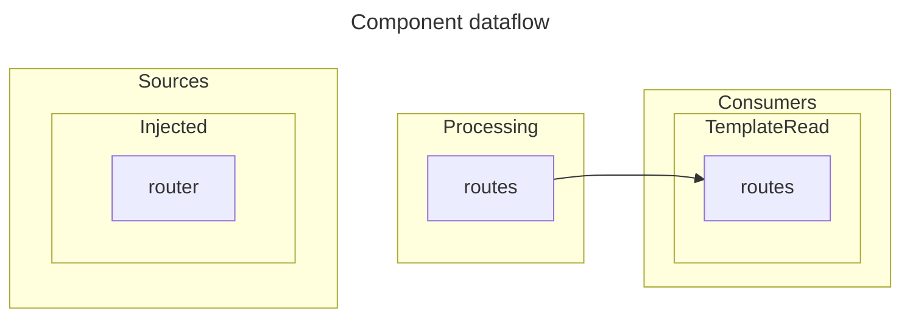

# app.component

```mermaid
---
title: Component dataflow
---
graph LR
    subgraph Sources
        subgraph Injected
            direction LR
            Source_router["
                router
            "]
        end
    end
    subgraph Processing
        Processing_routes["
            routes
        "]
    end
    subgraph Consumers
        subgraph TemplateRead
            direction LR
            Consumer_routes["
                routes
            "]
        end
    end
    Sources ~~~ Processing
    Processing ~~~ Consumers
    Processing_routes --> Consumer_routes

```

## Legend

```mermaid

graph TB
  Common["Common"]
  Reactive("Reactive")
  Reactive_writable("Reactive writable")
  Mutable["Mutable"]

  style Mutable fill:#500  
  style Reactive_writable fill:#430
```
