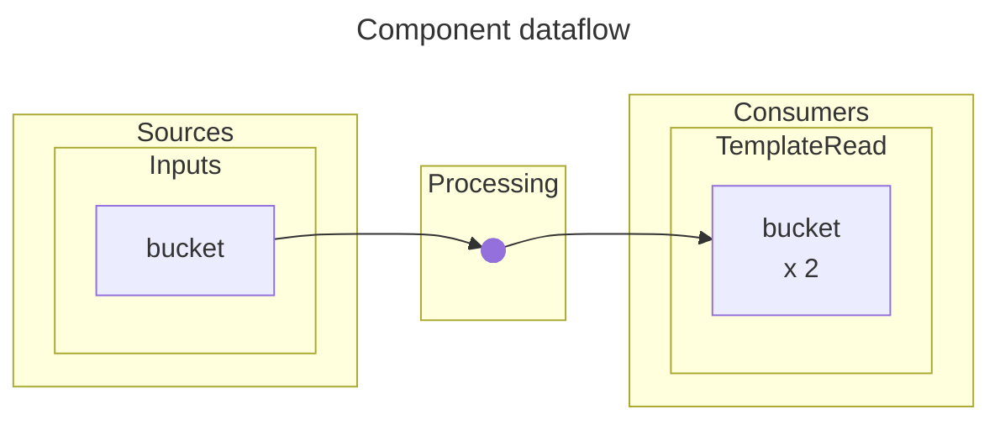

# client-bucket.component

```mermaid
---
title: Component dataflow
---
graph LR
    subgraph Sources
        subgraph Inputs
            Source_bucket["
                bucket
            "]
        end
    end
    subgraph Processing
        Processing_bucket@{ shape: f-circ, label: "Junction" }
    end
    subgraph Consumers
        subgraph TemplateRead
            Consumer_bucket["
                bucket
x            2
            "]
        end
    end
    Sources ~~~ Processing
    Processing ~~~ Consumers
    Source_bucket --> Processing_bucket
    Processing_bucket --> Consumer_bucket

```

