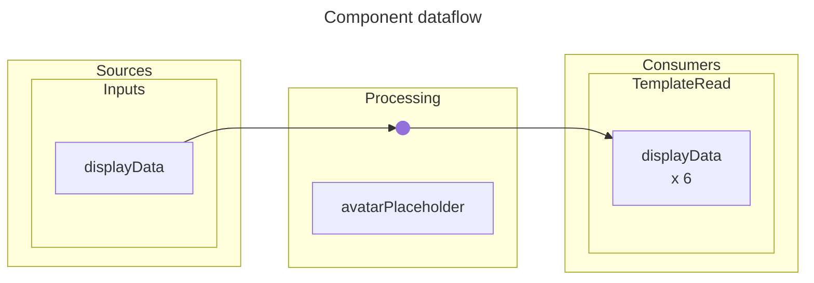

# client-info.component

```mermaid
---
title: Component dataflow
---
graph LR
    subgraph Sources
        subgraph Inputs
            Source_displayData["
                displayData
            "]
        end
    end
    subgraph Processing
        Processing_avatarPlaceholder["
            avatarPlaceholder
        "]
        Processing_displayData@{ shape: f-circ, label: "Junction" }
    end
    subgraph Consumers
        subgraph TemplateRead
            Consumer_displayData["
                displayData
x            6
            "]
        end
    end
    Sources ~~~ Processing
    Processing ~~~ Consumers
    Source_displayData --> Processing_displayData
    Processing_displayData --> Consumer_displayData

```

