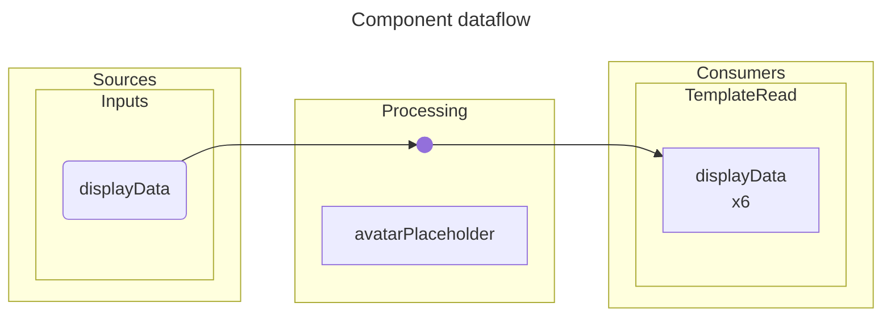

# client-info.component

```mermaid
---
title: Component dataflow
---
graph LR
    subgraph Sources
        subgraph Inputs
            direction LR
            Source_displayData("
                displayData
            ")
        end
    end
    subgraph Processing
        Processing_avatarPlaceholder["
            avatarPlaceholder
        "]
        Processing_displayData@{ shape: f-circ, label: "Junction" }
    end
    subgraph Consumers
        subgraph TemplateRead
            direction LR
            Consumer_displayData["
                displayData
                x6
            "]
        end
    end
    Sources ~~~ Processing
    Processing ~~~ Consumers
    Source_displayData --> Processing_displayData
    Processing_displayData --> Consumer_displayData

```

## Legend

```mermaid

graph TB
  Common["Common"]
  Reactive("Reactive")
  Reactive_writable("Reactive writable")
  Mutable["Mutable"]

  style Mutable fill:#500  
  style Reactive_writable fill:#430
```
