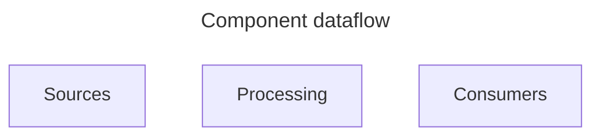

# client-skeleton.component

```mermaid
---
title: Component dataflow
---
graph LR
    Sources ~~~ Processing
    Processing ~~~ Consumers

```

## Legend

```mermaid

graph TB
  Common["Common"]
  Reactive("Reactive")
  Reactive_writable("Reactive writable")
  Mutable["Mutable"]

  style Mutable fill:#500  
  style Reactive_writable fill:#430
```
