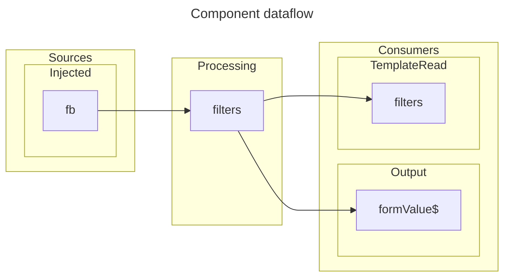

# clients-filter-form.component

```mermaid
---
title: Component dataflow
---
graph LR
    subgraph Sources
        subgraph Injected
            direction LR
            Source_fb["
                fb
            "]
        end
    end
    subgraph Processing
        Processing_filters["
            filters
        "]
    end
    subgraph Consumers
        subgraph Output
            direction LR
            Consumer_formValue$["
                formValue$
            "]
        end
        subgraph TemplateRead
            direction LR
            Consumer_filters["
                filters
            "]
        end
    end
    Sources ~~~ Processing
    Processing ~~~ Consumers
    Source_fb --> Processing_filters
    Processing_filters --> Consumer_formValue$
    Processing_filters --> Consumer_filters

```

## Legend

```mermaid

graph TB
  Common["Common"]
  Reactive("Reactive")
  Reactive_writable("Reactive writable")
  Mutable["Mutable"]

  style Mutable fill:#500  
  style Reactive_writable fill:#430
```
