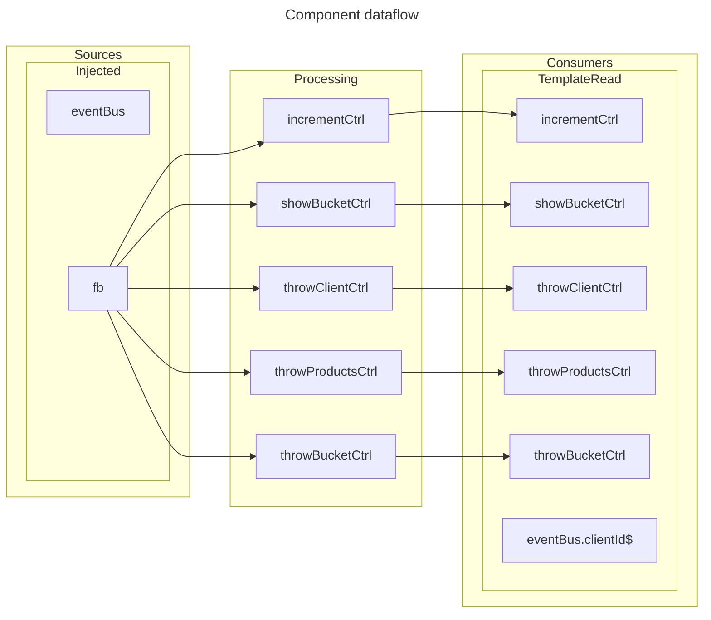

# controller.component

```mermaid
---
title: Component dataflow
---
graph LR
    subgraph Sources
        subgraph Injected
            direction LR
            Source_eventBus["
                eventBus
            "]
            Source_fb["
                fb
            "]
        end
    end
    subgraph Processing
        Processing_incrementCtrl["
            incrementCtrl
        "]
        Processing_showBucketCtrl["
            showBucketCtrl
        "]
        Processing_throwClientCtrl["
            throwClientCtrl
        "]
        Processing_throwProductsCtrl["
            throwProductsCtrl
        "]
        Processing_throwBucketCtrl["
            throwBucketCtrl
        "]
    end
    subgraph Consumers
        subgraph TemplateRead
            direction LR
            Consumer_incrementCtrl["
                incrementCtrl
            "]
            Consumer_showBucketCtrl["
                showBucketCtrl
            "]
            Consumer_throwClientCtrl["
                throwClientCtrl
            "]
            Consumer_throwProductsCtrl["
                throwProductsCtrl
            "]
            Consumer_throwBucketCtrl["
                throwBucketCtrl
            "]
            Consumer_eventBus.clientId$["
                eventBus.clientId$
            "]
        end
    end
    Sources ~~~ Processing
    Processing ~~~ Consumers
    Source_fb --> Processing_incrementCtrl
    Source_fb --> Processing_showBucketCtrl
    Source_fb --> Processing_throwClientCtrl
    Source_fb --> Processing_throwProductsCtrl
    Source_fb --> Processing_throwBucketCtrl
    Processing_incrementCtrl --> Consumer_incrementCtrl
    Processing_showBucketCtrl --> Consumer_showBucketCtrl
    Processing_throwClientCtrl --> Consumer_throwClientCtrl
    Processing_throwProductsCtrl --> Consumer_throwProductsCtrl
    Processing_throwBucketCtrl --> Consumer_throwBucketCtrl

```

## Legend

```mermaid

graph TB
  Common["Common"]
  Reactive("Reactive")
  Reactive_writable("Reactive writable")
  Mutable["Mutable"]

  style Mutable fill:#500  
  style Reactive_writable fill:#430
```
