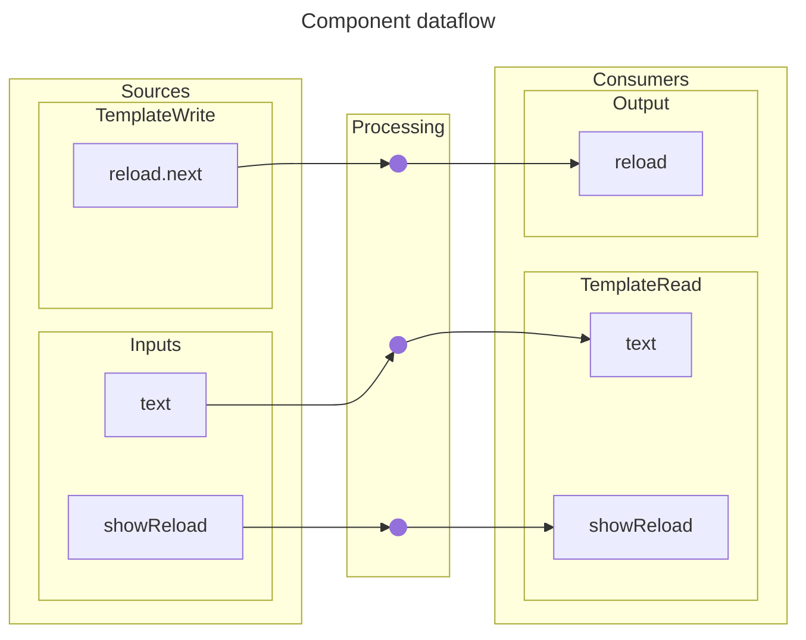

# generic-error.component

```mermaid
---
title: Component dataflow
---
graph LR
    subgraph Sources
        subgraph Inputs
            Source_text["
                text
            "]
            Source_showReload["
                showReload
            "]
        end
        subgraph TemplateWrite
            Source_reload.next["
                reload.next
            "]
        end
    end
    subgraph Processing
        Processing_text@{ shape: f-circ, label: "Junction" }
        Processing_showReload@{ shape: f-circ, label: "Junction" }
        Processing_reload@{ shape: f-circ, label: "Junction" }
    end
    subgraph Consumers
        subgraph Output
            Consumer_reload["
                reload
            "]
        end
        subgraph TemplateRead
            Consumer_text["
                text
            "]
            Consumer_showReload["
                showReload
            "]
        end
    end
    Sources ~~~ Processing
    Processing ~~~ Consumers
    Source_text --> Processing_text
    Source_showReload --> Processing_showReload
    Source_reload.next --> Processing_reload
    Processing_text --> Consumer_text
    Processing_showReload --> Consumer_showReload
    Processing_reload --> Consumer_reload

```

