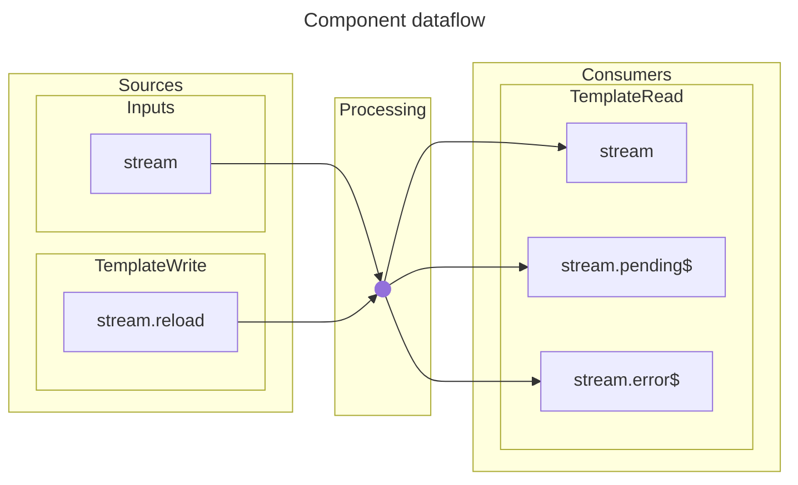

# stateful-block.component

```mermaid
---
title: Component dataflow
---
graph LR
    subgraph Sources
        subgraph Inputs
            Source_stream["
                stream
            "]
        end
        subgraph TemplateWrite
            Source_stream.reload["
                stream.reload
            "]
        end
    end
    subgraph Processing
        Processing_stream@{ shape: f-circ, label: "Junction" }
    end
    subgraph Consumers
        subgraph TemplateRead
            Consumer_stream["
                stream
            "]
            Consumer_stream.pending$["
                stream.pending$
            "]
            Consumer_stream.error$["
                stream.error$
            "]
        end
    end
    Sources ~~~ Processing
    Processing ~~~ Consumers
    Source_stream --> Processing_stream
    Source_stream.reload --> Processing_stream
    Processing_stream --> Consumer_stream
    Processing_stream --> Consumer_stream.pending$
    Processing_stream --> Consumer_stream.error$

```

