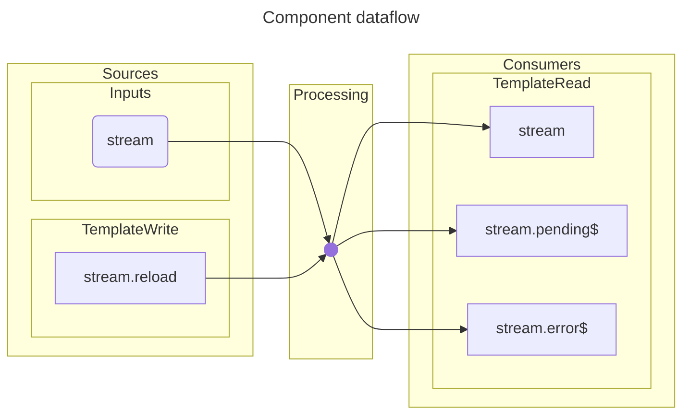

# stateful-block.component

```mermaid
---
title: Component dataflow
---
graph LR
    subgraph Sources
        subgraph Inputs
            direction LR
            Source_stream("
                stream
            ")
        end
        subgraph TemplateWrite
            direction LR
            Source_stream.reload["
                stream.reload
            "]
        end
    end
    subgraph Processing
        Processing_stream@{ shape: f-circ, label: "Junction" }
    end
    subgraph Consumers
        subgraph TemplateRead
            direction LR
            Consumer_stream["
                stream
            "]
            Consumer_stream.pending$["
                stream.pending$
            "]
            Consumer_stream.error$["
                stream.error$
            "]
        end
    end
    Sources ~~~ Processing
    Processing ~~~ Consumers
    Source_stream --> Processing_stream
    Source_stream.reload --> Processing_stream
    Processing_stream --> Consumer_stream
    Processing_stream --> Consumer_stream.pending$
    Processing_stream --> Consumer_stream.error$

```

## Legend

```mermaid

graph TB
  Common["Common"]
  Reactive("Reactive")
  Reactive_writable("Reactive writable")
  Mutable["Mutable"]

  style Mutable fill:#500  
  style Reactive_writable fill:#430
```
