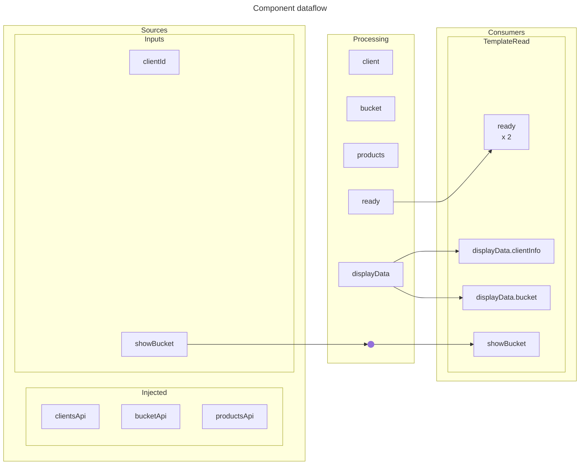

# multi-subscribe.component

```mermaid
---
title: Component dataflow
---
graph LR
    subgraph Sources
        subgraph Injected
            Source_clientsApi["
                clientsApi
            "]
            Source_bucketApi["
                bucketApi
            "]
            Source_productsApi["
                productsApi
            "]
        end
        subgraph Inputs
            Source_clientId["
                clientId
            "]
            Source_showBucket["
                showBucket
            "]
        end
    end
    subgraph Processing
        Processing_client["
            client
        "]
        Processing_bucket["
            bucket
        "]
        Processing_products["
            products
        "]
        Processing_ready["
            ready
        "]
        Processing_displayData["
            displayData
        "]
        Processing_showBucket@{ shape: f-circ, label: "Junction" }
    end
    subgraph Consumers
        subgraph TemplateRead
            Consumer_ready["
                ready
x            2
            "]
            Consumer_displayData.clientInfo["
                displayData.clientInfo
            "]
            Consumer_showBucket["
                showBucket
            "]
            Consumer_displayData.bucket["
                displayData.bucket
            "]
        end
    end
    Sources ~~~ Processing
    Processing ~~~ Consumers
    Source_showBucket --> Processing_showBucket
    Processing_showBucket --> Consumer_showBucket
    Processing_ready --> Consumer_ready
    Processing_displayData --> Consumer_displayData.clientInfo
    Processing_displayData --> Consumer_displayData.bucket

```

