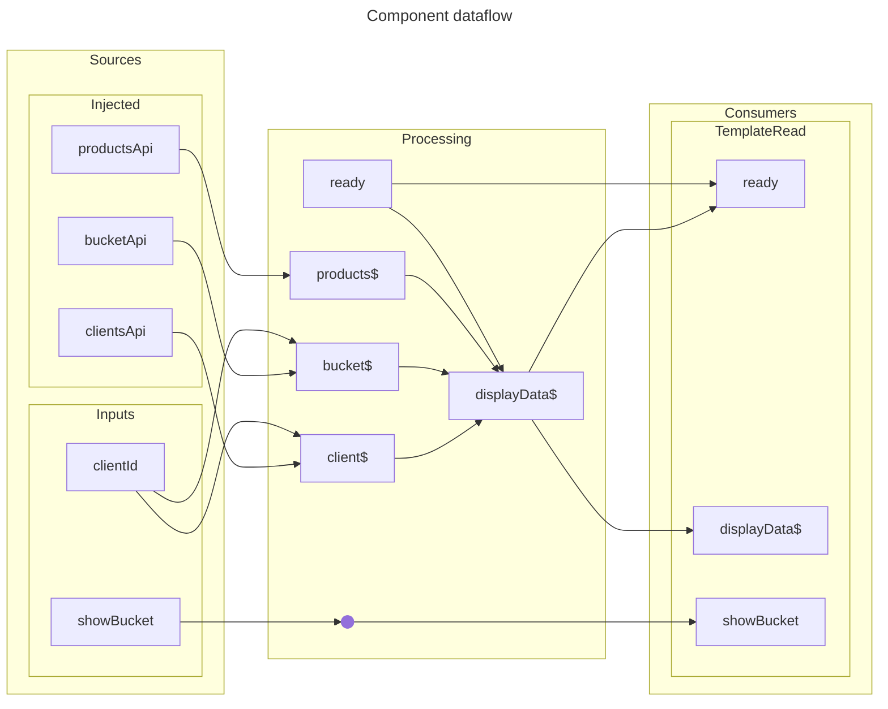

# almost-there.component

```mermaid
---
title: Component dataflow
---
graph LR
    subgraph Sources
        subgraph Injected
            Source_clientsApi["
                clientsApi
            "]
            Source_bucketApi["
                bucketApi
            "]
            Source_productsApi["
                productsApi
            "]
        end
        subgraph Inputs
            Source_clientId["
                clientId
            "]
            Source_showBucket["
                showBucket
            "]
        end
    end
    subgraph Processing
        Processing_ready["
            ready
        "]
        Processing_client$["
            client$
        "]
        Processing_bucket$["
            bucket$
        "]
        Processing_products$["
            products$
        "]
        Processing_displayData$["
            displayData$
        "]
        Processing_showBucket@{ shape: f-circ, label: "Junction" }
    end
    subgraph Consumers
        subgraph TemplateRead
            Consumer_ready["
                ready
            "]
            Consumer_displayData$["
                displayData$
            "]
            Consumer_showBucket["
                showBucket
            "]
        end
    end
    Sources ~~~ Processing
    Processing ~~~ Consumers
    Source_showBucket --> Processing_showBucket
    Source_clientsApi --> Processing_client$
    Source_clientId --> Processing_client$
    Source_bucketApi --> Processing_bucket$
    Source_clientId --> Processing_bucket$
    Source_productsApi --> Processing_products$
    Processing_client$ --> Processing_displayData$
    Processing_bucket$ --> Processing_displayData$
    Processing_products$ --> Processing_displayData$
    Processing_ready --> Processing_displayData$
    Processing_displayData$ --> Consumer_ready
    Processing_showBucket --> Consumer_showBucket
    Processing_ready --> Consumer_ready
    Processing_displayData$ --> Consumer_displayData$

```

