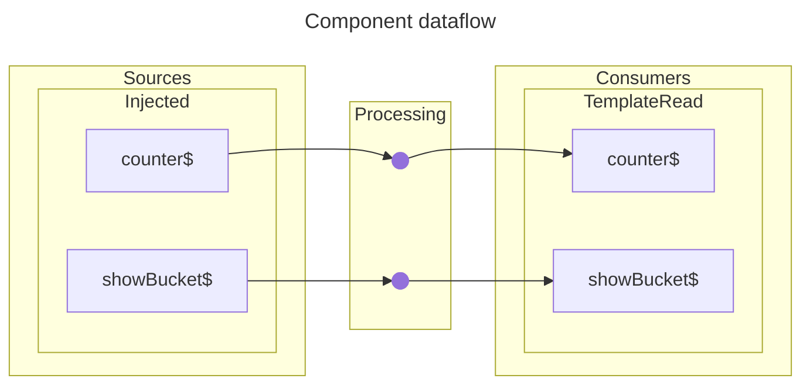

# stream-input-wrapper.component

```mermaid
---
title: Component dataflow
---
graph LR
    subgraph Sources
        subgraph Injected
            Source_counter$["
                counter$
            "]
            Source_showBucket$["
                showBucket$
            "]
        end
    end
    subgraph Processing
        Processing_counter$@{ shape: f-circ, label: "Junction" }
        Processing_showBucket$@{ shape: f-circ, label: "Junction" }
    end
    subgraph Consumers
        subgraph TemplateRead
            Consumer_counter$["
                counter$
            "]
            Consumer_showBucket$["
                showBucket$
            "]
        end
    end
    Sources ~~~ Processing
    Processing ~~~ Consumers
    Source_counter$ --> Processing_counter$
    Source_showBucket$ --> Processing_showBucket$
    Processing_counter$ --> Consumer_counter$
    Processing_showBucket$ --> Consumer_showBucket$

```

