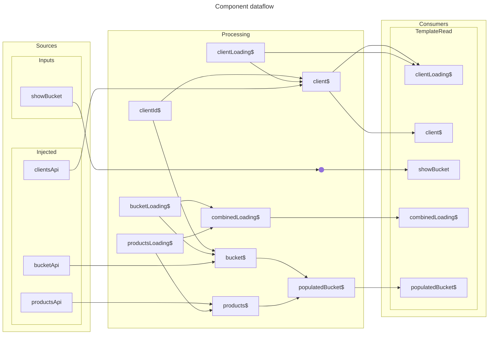

# stream.component

```mermaid
---
title: Component dataflow
---
graph LR
    subgraph Sources
        subgraph Injected
            Source_clientsApi["
                clientsApi
            "]
            Source_bucketApi["
                bucketApi
            "]
            Source_productsApi["
                productsApi
            "]
        end
        subgraph Inputs
            Source_showBucket["
                showBucket
            "]
        end
    end
    subgraph Processing
        Processing_clientId$["
            clientId$
        "]
        Processing_clientLoading$["
            clientLoading$
        "]
        Processing_bucketLoading$["
            bucketLoading$
        "]
        Processing_productsLoading$["
            productsLoading$
        "]
        Processing_client$["
            client$
        "]
        Processing_bucket$["
            bucket$
        "]
        Processing_products$["
            products$
        "]
        Processing_populatedBucket$["
            populatedBucket$
        "]
        Processing_combinedLoading$["
            combinedLoading$
        "]
        Processing_showBucket@{ shape: f-circ, label: "Junction" }
    end
    subgraph Consumers
        subgraph TemplateRead
            Consumer_clientLoading$["
                clientLoading$
            "]
            Consumer_client$["
                client$
            "]
            Consumer_showBucket["
                showBucket
            "]
            Consumer_combinedLoading$["
                combinedLoading$
            "]
            Consumer_populatedBucket$["
                populatedBucket$
            "]
        end
    end
    Sources ~~~ Processing
    Processing ~~~ Consumers
    Source_showBucket --> Processing_showBucket
    Processing_clientId$ --> Processing_client$
    Processing_clientLoading$ --> Processing_client$
    Processing_client$ --> Consumer_clientLoading$
    Source_clientsApi --> Processing_client$
    Processing_clientId$ --> Processing_bucket$
    Processing_bucketLoading$ --> Processing_bucket$
    Source_bucketApi --> Processing_bucket$
    Source_productsApi --> Processing_products$
    Processing_productsLoading$ --> Processing_products$
    Processing_bucket$ --> Processing_populatedBucket$
    Processing_products$ --> Processing_populatedBucket$
    Processing_bucketLoading$ --> Processing_combinedLoading$
    Processing_productsLoading$ --> Processing_combinedLoading$
    Processing_showBucket --> Consumer_showBucket
    Processing_clientLoading$ --> Consumer_clientLoading$
    Processing_client$ --> Consumer_client$
    Processing_combinedLoading$ --> Consumer_combinedLoading$
    Processing_populatedBucket$ --> Consumer_populatedBucket$

```

