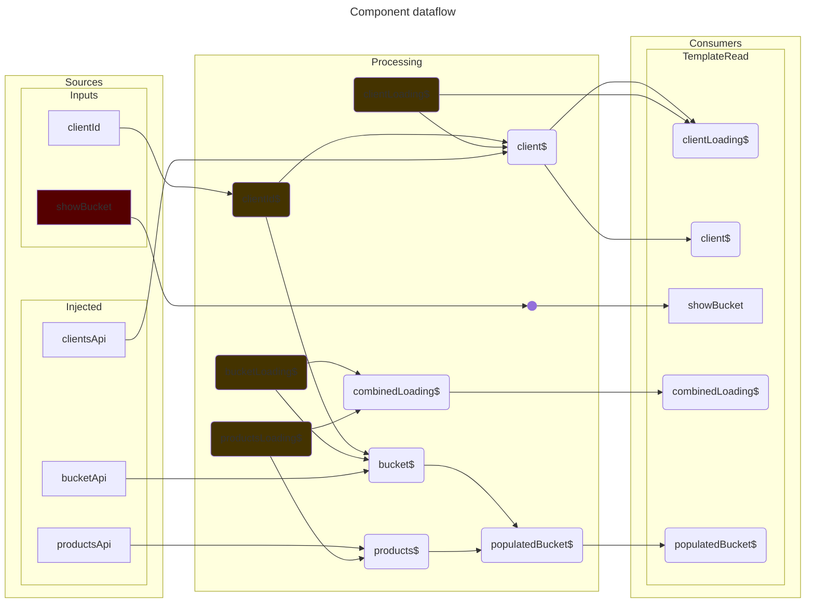
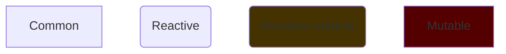

# stream.component

```mermaid
---
title: Component dataflow
---
graph LR
    subgraph Sources
        subgraph Injected
            direction LR
            Source_clientsApi["
                clientsApi
            "]
            Source_bucketApi["
                bucketApi
            "]
            Source_productsApi["
                productsApi
            "]
        end
        subgraph Inputs
            direction LR
            Source_showBucket["
                showBucket
            "]
            Source_clientId["
                clientId
            "]
        end
    end
    subgraph Processing
        Processing_clientId$("
            clientId$
        ")
        Processing_clientLoading$("
            clientLoading$
        ")
        Processing_bucketLoading$("
            bucketLoading$
        ")
        Processing_productsLoading$("
            productsLoading$
        ")
        Processing_client$("
            client$
        ")
        Processing_bucket$("
            bucket$
        ")
        Processing_products$("
            products$
        ")
        Processing_populatedBucket$("
            populatedBucket$
        ")
        Processing_combinedLoading$("
            combinedLoading$
        ")
        Processing_showBucket@{ shape: f-circ, label: "Junction" }
    end
    subgraph Consumers
        subgraph TemplateRead
            direction LR
            Consumer_clientLoading$("
                clientLoading$
            ")
            Consumer_client$("
                client$
            ")
            Consumer_showBucket["
                showBucket
            "]
            Consumer_combinedLoading$("
                combinedLoading$
            ")
            Consumer_populatedBucket$("
                populatedBucket$
            ")
        end
    end
    Sources ~~~ Processing
    Processing ~~~ Consumers
    Source_showBucket --> Processing_showBucket
    Source_clientId --> Processing_clientId$
    Processing_clientId$ --> Processing_client$
    Processing_clientLoading$ --> Processing_client$
    Processing_client$ --> Consumer_clientLoading$
    Source_clientsApi --> Processing_client$
    Processing_clientId$ --> Processing_bucket$
    Processing_bucketLoading$ --> Processing_bucket$
    Source_bucketApi --> Processing_bucket$
    Source_productsApi --> Processing_products$
    Processing_productsLoading$ --> Processing_products$
    Processing_bucket$ --> Processing_populatedBucket$
    Processing_products$ --> Processing_populatedBucket$
    Processing_bucketLoading$ --> Processing_combinedLoading$
    Processing_productsLoading$ --> Processing_combinedLoading$
    Processing_showBucket --> Consumer_showBucket
    Processing_clientLoading$ --> Consumer_clientLoading$
    Processing_client$ --> Consumer_client$
    Processing_combinedLoading$ --> Consumer_combinedLoading$
    Processing_populatedBucket$ --> Consumer_populatedBucket$
    style Source_showBucket fill:#500
    style Processing_clientId$ fill:#430
    style Processing_clientLoading$ fill:#430
    style Processing_bucketLoading$ fill:#430
    style Processing_productsLoading$ fill:#430

```

## Legend

```mermaid

graph TB
  Common["Common"]
  Reactive("Reactive")
  Reactive_writable("Reactive writable")
  Mutable["Mutable"]

  style Mutable fill:#500  
  style Reactive_writable fill:#430
```
