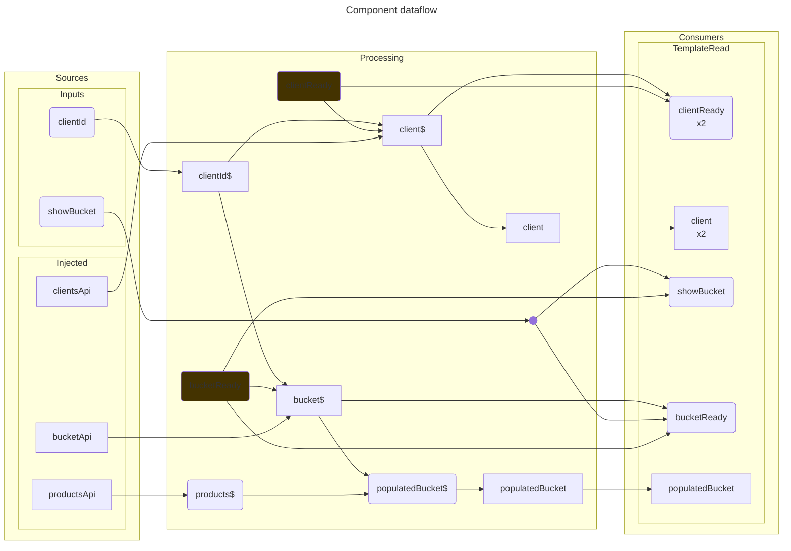
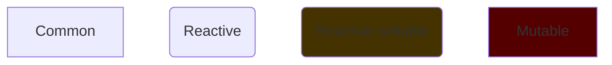

# signal.component

```mermaid
---
title: Component dataflow
---
graph LR
    subgraph Sources
        subgraph Injected
            direction LR
            Source_clientsApi["
                clientsApi
            "]
            Source_bucketApi["
                bucketApi
            "]
            Source_productsApi["
                productsApi
            "]
        end
        subgraph Inputs
            direction LR
            Source_clientId("
                clientId
            ")
            Source_showBucket("
                showBucket
            ")
        end
    end
    subgraph Processing
        Processing_clientId$["
            clientId$
        "]
        Processing_clientReady("
            clientReady
        ")
        Processing_bucketReady("
            bucketReady
        ")
        Processing_client$["
            client$
        "]
        Processing_bucket$["
            bucket$
        "]
        Processing_products$("
            products$
        ")
        Processing_populatedBucket$("
            populatedBucket$
        ")
        Processing_client["
            client
        "]
        Processing_populatedBucket["
            populatedBucket
        "]
        Processing_showBucket@{ shape: f-circ, label: "Junction" }
    end
    subgraph Consumers
        subgraph TemplateRead
            direction LR
            Consumer_clientReady("
                clientReady
                x2
            ")
            Consumer_client["
                client
                x2
            "]
            Consumer_showBucket("
                showBucket
            ")
            Consumer_bucketReady("
                bucketReady
            ")
            Consumer_populatedBucket["
                populatedBucket
            "]
        end
    end
    Sources ~~~ Processing
    Processing ~~~ Consumers
    Source_showBucket --> Processing_showBucket
    Source_clientId --> Processing_clientId$
    Processing_clientId$ --> Processing_client$
    Processing_clientReady --> Processing_client$
    Processing_client$ --> Consumer_clientReady
    Source_clientsApi --> Processing_client$
    Processing_clientId$ --> Processing_bucket$
    Processing_bucketReady --> Processing_bucket$
    Processing_bucket$ --> Consumer_bucketReady
    Source_bucketApi --> Processing_bucket$
    Source_productsApi --> Processing_products$
    Processing_bucket$ --> Processing_populatedBucket$
    Processing_products$ --> Processing_populatedBucket$
    Processing_client$ --> Processing_client
    Processing_populatedBucket$ --> Processing_populatedBucket
    Processing_showBucket --> Consumer_showBucket
    Processing_clientReady --> Consumer_clientReady
    Processing_client --> Consumer_client
    Processing_bucketReady --> Consumer_showBucket
    Processing_showBucket --> Consumer_bucketReady
    Processing_bucketReady --> Consumer_bucketReady
    Processing_populatedBucket --> Consumer_populatedBucket
    style Processing_clientReady fill:#430
    style Processing_bucketReady fill:#430

```

## Legend

```mermaid

graph TB
  Common["Common"]
  Reactive("Reactive")
  Reactive_writable("Reactive writable")
  Mutable["Mutable"]

  style Mutable fill:#500  
  style Reactive_writable fill:#430
```
