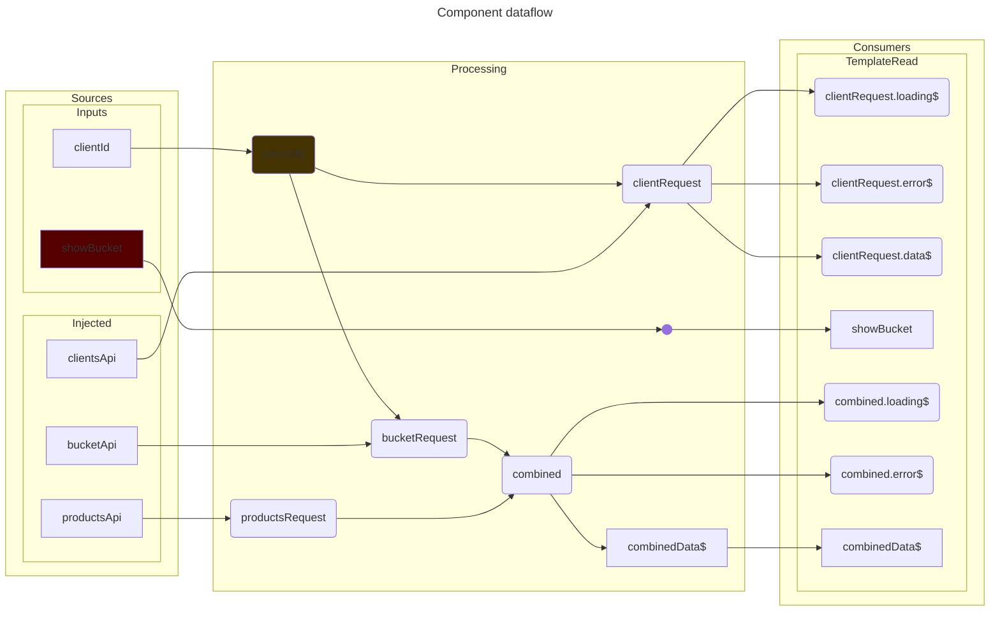
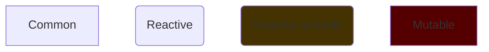

# container-rx.component

```mermaid
---
title: Component dataflow
---
graph LR
    subgraph Sources
        subgraph Injected
            direction LR
            Source_clientsApi["
                clientsApi
            "]
            Source_bucketApi["
                bucketApi
            "]
            Source_productsApi["
                productsApi
            "]
        end
        subgraph Inputs
            direction LR
            Source_showBucket["
                showBucket
            "]
            Source_clientId["
                clientId
            "]
        end
    end
    subgraph Processing
        Processing_clientId$("
            clientId$
        ")
        Processing_productsRequest("
            productsRequest
        ")
        Processing_clientRequest("
            clientRequest
        ")
        Processing_bucketRequest("
            bucketRequest
        ")
        Processing_combined("
            combined
        ")
        Processing_combinedData$["
            combinedData$
        "]
        Processing_showBucket@{ shape: f-circ, label: "Junction" }
    end
    subgraph Consumers
        subgraph TemplateRead
            direction LR
            Consumer_clientRequest.loading$("
                clientRequest.loading$
            ")
            Consumer_clientRequest.error$("
                clientRequest.error$
            ")
            Consumer_clientRequest.data$("
                clientRequest.data$
            ")
            Consumer_showBucket["
                showBucket
            "]
            Consumer_combined.loading$("
                combined.loading$
            ")
            Consumer_combined.error$("
                combined.error$
            ")
            Consumer_combinedData$["
                combinedData$
            "]
        end
    end
    Sources ~~~ Processing
    Processing ~~~ Consumers
    Source_showBucket --> Processing_showBucket
    Source_clientId --> Processing_clientId$
    Source_productsApi --> Processing_productsRequest
    Processing_clientId$ --> Processing_clientRequest
    Source_clientsApi --> Processing_clientRequest
    Processing_clientId$ --> Processing_bucketRequest
    Source_bucketApi --> Processing_bucketRequest
    Processing_bucketRequest --> Processing_combined
    Processing_productsRequest --> Processing_combined
    Processing_combined --> Processing_combinedData$
    Processing_showBucket --> Consumer_showBucket
    Processing_clientRequest --> Consumer_clientRequest.loading$
    Processing_clientRequest --> Consumer_clientRequest.error$
    Processing_clientRequest --> Consumer_clientRequest.data$
    Processing_combined --> Consumer_combined.loading$
    Processing_combined --> Consumer_combined.error$
    Processing_combinedData$ --> Consumer_combinedData$
    style Source_showBucket fill:#500
    style Processing_clientId$ fill:#430

```

## Legend

```mermaid

graph TB
  Common["Common"]
  Reactive("Reactive")
  Reactive_writable("Reactive writable")
  Mutable["Mutable"]

  style Mutable fill:#500  
  style Reactive_writable fill:#430
```
