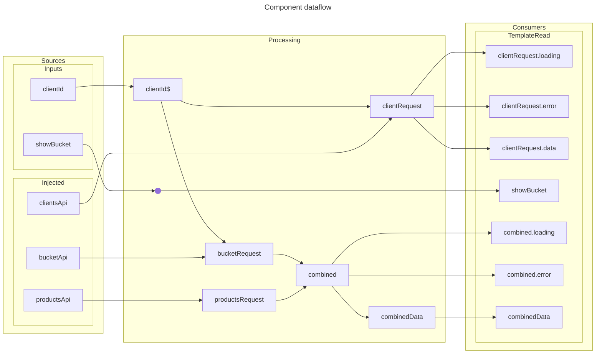

# container-signal.component

```mermaid
---
title: Component dataflow
---
graph LR
    subgraph Sources
        subgraph Injected
            Source_clientsApi["
                clientsApi
            "]
            Source_bucketApi["
                bucketApi
            "]
            Source_productsApi["
                productsApi
            "]
        end
        subgraph Inputs
            Source_clientId["
                clientId
            "]
            Source_showBucket["
                showBucket
            "]
        end
    end
    subgraph Processing
        Processing_clientId$["
            clientId$
        "]
        Processing_productsRequest["
            productsRequest
        "]
        Processing_clientRequest["
            clientRequest
        "]
        Processing_bucketRequest["
            bucketRequest
        "]
        Processing_combined["
            combined
        "]
        Processing_combinedData["
            combinedData
        "]
        Processing_showBucket@{ shape: f-circ, label: "Junction" }
    end
    subgraph Consumers
        subgraph TemplateRead
            Consumer_clientRequest.loading["
                clientRequest.loading
            "]
            Consumer_clientRequest.error["
                clientRequest.error
            "]
            Consumer_clientRequest.data["
                clientRequest.data
            "]
            Consumer_showBucket["
                showBucket
            "]
            Consumer_combined.loading["
                combined.loading
            "]
            Consumer_combined.error["
                combined.error
            "]
            Consumer_combinedData["
                combinedData
            "]
        end
    end
    Sources ~~~ Processing
    Processing ~~~ Consumers
    Source_showBucket --> Processing_showBucket
    Source_clientId --> Processing_clientId$
    Source_productsApi --> Processing_productsRequest
    Processing_clientId$ --> Processing_clientRequest
    Source_clientsApi --> Processing_clientRequest
    Processing_clientId$ --> Processing_bucketRequest
    Source_bucketApi --> Processing_bucketRequest
    Processing_bucketRequest --> Processing_combined
    Processing_productsRequest --> Processing_combined
    Processing_combined --> Processing_combinedData
    Processing_showBucket --> Consumer_showBucket
    Processing_clientRequest --> Consumer_clientRequest.loading
    Processing_clientRequest --> Consumer_clientRequest.error
    Processing_clientRequest --> Consumer_clientRequest.data
    Processing_combined --> Consumer_combined.loading
    Processing_combined --> Consumer_combined.error
    Processing_combinedData --> Consumer_combinedData

```

