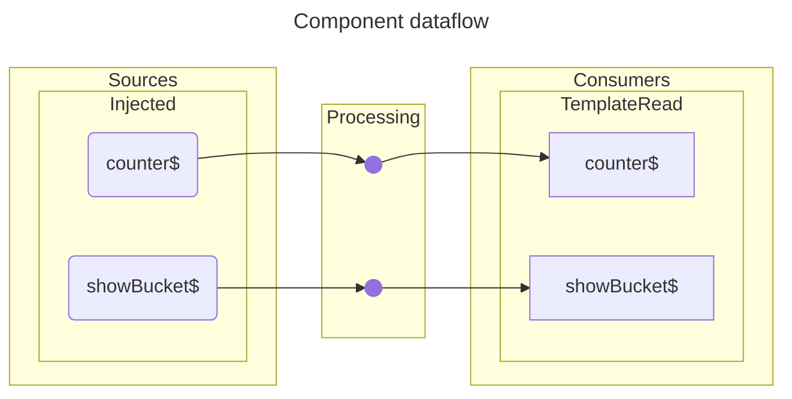

# resource-input-wrapper.component

```mermaid
---
title: Component dataflow
---
graph LR
    subgraph Sources
        subgraph Injected
            direction LR
            Source_counter$("
                counter$
            ")
            Source_showBucket$("
                showBucket$
            ")
        end
    end
    subgraph Processing
        Processing_counter$@{ shape: f-circ, label: "Junction" }
        Processing_showBucket$@{ shape: f-circ, label: "Junction" }
    end
    subgraph Consumers
        subgraph TemplateRead
            direction LR
            Consumer_counter$["
                counter$
            "]
            Consumer_showBucket$["
                showBucket$
            "]
        end
    end
    Sources ~~~ Processing
    Processing ~~~ Consumers
    Source_counter$ --> Processing_counter$
    Source_showBucket$ --> Processing_showBucket$
    Processing_counter$ --> Consumer_counter$
    Processing_showBucket$ --> Consumer_showBucket$

```

## Legend

```mermaid

graph TB
  Common["Common"]
  Reactive("Reactive")
  Reactive_writable("Reactive writable")
  Mutable["Mutable"]

  style Mutable fill:#500  
  style Reactive_writable fill:#430
```
