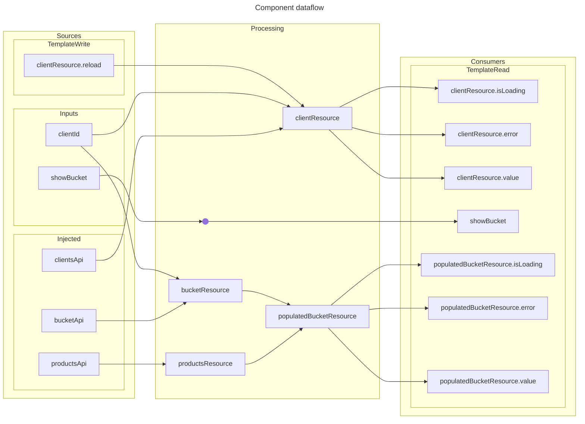

# resource.component

```mermaid
---
title: Component dataflow
---
graph LR
    subgraph Sources
        subgraph Injected
            Source_clientsApi["
                clientsApi
            "]
            Source_bucketApi["
                bucketApi
            "]
            Source_productsApi["
                productsApi
            "]
        end
        subgraph Inputs
            Source_clientId["
                clientId
            "]
            Source_showBucket["
                showBucket
            "]
        end
        subgraph TemplateWrite
            Source_clientResource.reload["
                clientResource.reload
            "]
        end
    end
    subgraph Processing
        Processing_clientResource["
            clientResource
        "]
        Processing_productsResource["
            productsResource
        "]
        Processing_bucketResource["
            bucketResource
        "]
        Processing_populatedBucketResource["
            populatedBucketResource
        "]
        Processing_showBucket@{ shape: f-circ, label: "Junction" }
    end
    subgraph Consumers
        subgraph TemplateRead
            Consumer_clientResource.isLoading["
                clientResource.isLoading
            "]
            Consumer_clientResource.error["
                clientResource.error
            "]
            Consumer_clientResource.value["
                clientResource.value
            "]
            Consumer_showBucket["
                showBucket
            "]
            Consumer_populatedBucketResource.isLoading["
                populatedBucketResource.isLoading
            "]
            Consumer_populatedBucketResource.error["
                populatedBucketResource.error
            "]
            Consumer_populatedBucketResource.value["
                populatedBucketResource.value
            "]
        end
    end
    Sources ~~~ Processing
    Processing ~~~ Consumers
    Source_showBucket --> Processing_showBucket
    Source_clientResource.reload --> Processing_clientResource
    Source_clientId --> Processing_clientResource
    Source_clientsApi --> Processing_clientResource
    Source_productsApi --> Processing_productsResource
    Source_clientId --> Processing_bucketResource
    Source_bucketApi --> Processing_bucketResource
    Processing_bucketResource --> Processing_populatedBucketResource
    Processing_productsResource --> Processing_populatedBucketResource
    Processing_showBucket --> Consumer_showBucket
    Processing_clientResource --> Consumer_clientResource.isLoading
    Processing_clientResource --> Consumer_clientResource.error
    Processing_clientResource --> Consumer_clientResource.value
    Processing_populatedBucketResource --> Consumer_populatedBucketResource.isLoading
    Processing_populatedBucketResource --> Consumer_populatedBucketResource.error
    Processing_populatedBucketResource --> Consumer_populatedBucketResource.value

```

