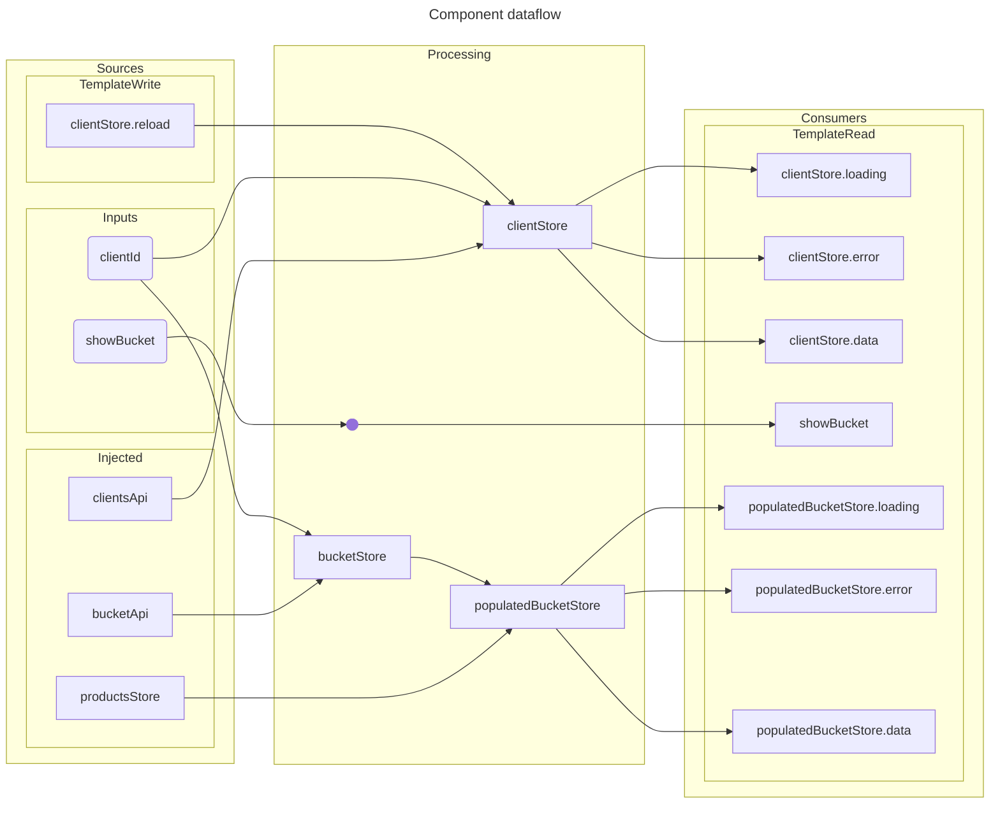

# tiny-rx-store.component

```mermaid
---
title: Component dataflow
---
graph LR
    subgraph Sources
        subgraph Injected
            direction LR
            Source_clientsApi["
                clientsApi
            "]
            Source_bucketApi["
                bucketApi
            "]
            Source_productsStore["
                productsStore
            "]
        end
        subgraph Inputs
            direction LR
            Source_clientId("
                clientId
            ")
            Source_showBucket("
                showBucket
            ")
        end
        subgraph TemplateWrite
            direction LR
            Source_clientStore.reload["
                clientStore.reload
            "]
        end
    end
    subgraph Processing
        Processing_clientStore["
            clientStore
        "]
        Processing_bucketStore["
            bucketStore
        "]
        Processing_populatedBucketStore["
            populatedBucketStore
        "]
        Processing_showBucket@{ shape: f-circ, label: "Junction" }
    end
    subgraph Consumers
        subgraph TemplateRead
            direction LR
            Consumer_clientStore.loading["
                clientStore.loading
            "]
            Consumer_clientStore.error["
                clientStore.error
            "]
            Consumer_clientStore.data["
                clientStore.data
            "]
            Consumer_showBucket["
                showBucket
            "]
            Consumer_populatedBucketStore.loading["
                populatedBucketStore.loading
            "]
            Consumer_populatedBucketStore.error["
                populatedBucketStore.error
            "]
            Consumer_populatedBucketStore.data["
                populatedBucketStore.data
            "]
        end
    end
    Sources ~~~ Processing
    Processing ~~~ Consumers
    Source_showBucket --> Processing_showBucket
    Source_clientStore.reload --> Processing_clientStore
    Source_clientId --> Processing_clientStore
    Source_clientsApi --> Processing_clientStore
    Source_clientId --> Processing_bucketStore
    Source_bucketApi --> Processing_bucketStore
    Processing_bucketStore --> Processing_populatedBucketStore
    Source_productsStore --> Processing_populatedBucketStore
    Processing_showBucket --> Consumer_showBucket
    Processing_clientStore --> Consumer_clientStore.loading
    Processing_clientStore --> Consumer_clientStore.error
    Processing_clientStore --> Consumer_clientStore.data
    Processing_populatedBucketStore --> Consumer_populatedBucketStore.loading
    Processing_populatedBucketStore --> Consumer_populatedBucketStore.error
    Processing_populatedBucketStore --> Consumer_populatedBucketStore.data

```

## Legend

```mermaid

graph TB
  Common["Common"]
  Reactive("Reactive")
  Reactive_writable("Reactive writable")
  Mutable["Mutable"]

  style Mutable fill:#500  
  style Reactive_writable fill:#430
```
