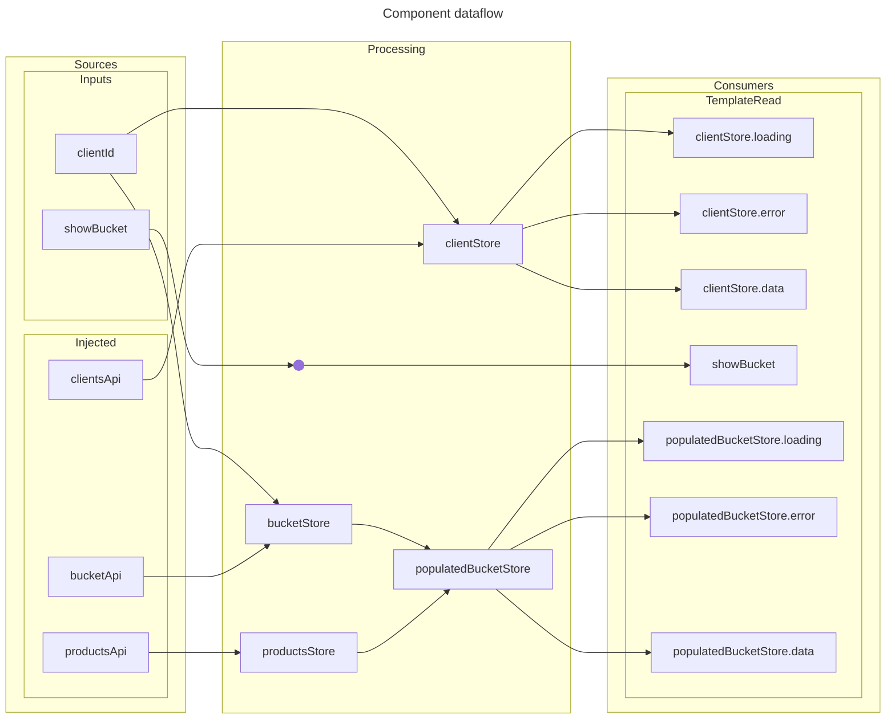

# tiny-store.component

```mermaid
---
title: Component dataflow
---
graph LR
    subgraph Sources
        subgraph Injected
            Source_clientsApi["
                clientsApi
            "]
            Source_bucketApi["
                bucketApi
            "]
            Source_productsApi["
                productsApi
            "]
        end
        subgraph Inputs
            Source_clientId["
                clientId
            "]
            Source_showBucket["
                showBucket
            "]
        end
    end
    subgraph Processing
        Processing_clientStore["
            clientStore
        "]
        Processing_productsStore["
            productsStore
        "]
        Processing_bucketStore["
            bucketStore
        "]
        Processing_populatedBucketStore["
            populatedBucketStore
        "]
        Processing_showBucket@{ shape: f-circ, label: "Junction" }
    end
    subgraph Consumers
        subgraph TemplateRead
            Consumer_clientStore.loading["
                clientStore.loading
            "]
            Consumer_clientStore.error["
                clientStore.error
            "]
            Consumer_clientStore.data["
                clientStore.data
            "]
            Consumer_showBucket["
                showBucket
            "]
            Consumer_populatedBucketStore.loading["
                populatedBucketStore.loading
            "]
            Consumer_populatedBucketStore.error["
                populatedBucketStore.error
            "]
            Consumer_populatedBucketStore.data["
                populatedBucketStore.data
            "]
        end
    end
    Sources ~~~ Processing
    Processing ~~~ Consumers
    Source_showBucket --> Processing_showBucket
    Source_clientId --> Processing_clientStore
    Source_clientsApi --> Processing_clientStore
    Source_productsApi --> Processing_productsStore
    Source_clientId --> Processing_bucketStore
    Source_bucketApi --> Processing_bucketStore
    Processing_bucketStore --> Processing_populatedBucketStore
    Processing_productsStore --> Processing_populatedBucketStore
    Processing_showBucket --> Consumer_showBucket
    Processing_clientStore --> Consumer_clientStore.loading
    Processing_clientStore --> Consumer_clientStore.error
    Processing_clientStore --> Consumer_clientStore.data
    Processing_populatedBucketStore --> Consumer_populatedBucketStore.loading
    Processing_populatedBucketStore --> Consumer_populatedBucketStore.error
    Processing_populatedBucketStore --> Consumer_populatedBucketStore.data

```

