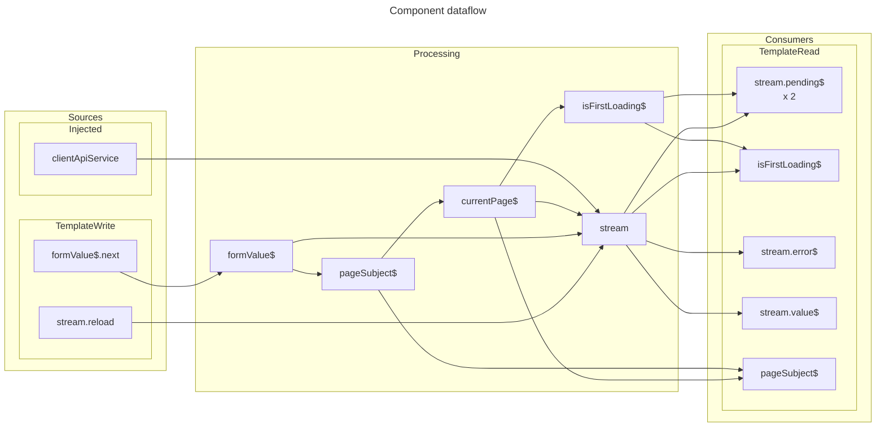

# infinite-scroll.component

```mermaid
---
title: Component dataflow
---
graph LR
    subgraph Sources
        subgraph Injected
            Source_clientApiService["
                clientApiService
            "]
        end
        subgraph TemplateWrite
            Source_formValue$.next["
                formValue$.next
            "]
            Source_stream.reload["
                stream.reload
            "]
        end
    end
    subgraph Processing
        Processing_formValue$["
            formValue$
        "]
        Processing_pageSubject$["
            pageSubject$
        "]
        Processing_currentPage$["
            currentPage$
        "]
        Processing_isFirstLoading$["
            isFirstLoading$
        "]
        Processing_stream["
            stream
        "]
    end
    subgraph Consumers
        subgraph TemplateRead
            Consumer_stream.pending$["
                stream.pending$
x            2
            "]
            Consumer_isFirstLoading$["
                isFirstLoading$
            "]
            Consumer_stream.error$["
                stream.error$
            "]
            Consumer_stream.value$["
                stream.value$
            "]
            Consumer_pageSubject$["
                pageSubject$
            "]
        end
    end
    Sources ~~~ Processing
    Processing ~~~ Consumers
    Source_formValue$.next --> Processing_formValue$
    Source_stream.reload --> Processing_stream
    Processing_formValue$ --> Processing_pageSubject$
    Processing_pageSubject$ --> Processing_currentPage$
    Processing_currentPage$ --> Consumer_pageSubject$
    Processing_currentPage$ --> Processing_isFirstLoading$
    Processing_formValue$ --> Processing_stream
    Processing_currentPage$ --> Processing_stream
    Source_clientApiService --> Processing_stream
    Processing_stream --> Consumer_stream.pending$
    Processing_isFirstLoading$ --> Consumer_stream.pending$
    Processing_stream --> Consumer_isFirstLoading$
    Processing_isFirstLoading$ --> Consumer_isFirstLoading$
    Processing_stream --> Consumer_stream.error$
    Processing_stream --> Consumer_stream.value$
    Processing_pageSubject$ --> Consumer_pageSubject$

```

