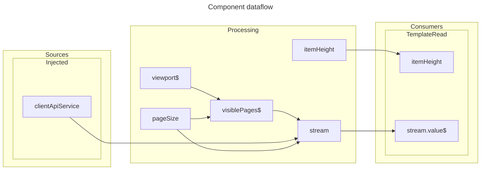

# virtual-scroll.component

```mermaid
---
title: Component dataflow
---
graph LR
    subgraph Sources
        subgraph Injected
            Source_clientApiService["
                clientApiService
            "]
        end
    end
    subgraph Processing
        Processing_viewport$["
            viewport$
        "]
        Processing_pageSize["
            pageSize
        "]
        Processing_itemHeight["
            itemHeight
        "]
        Processing_visiblePages$["
            visiblePages$
        "]
        Processing_stream["
            stream
        "]
    end
    subgraph Consumers
        subgraph TemplateRead
            Consumer_itemHeight["
                itemHeight
            "]
            Consumer_stream.value$["
                stream.value$
            "]
        end
    end
    Sources ~~~ Processing
    Processing ~~~ Consumers
    Processing_viewport$ --> Processing_visiblePages$
    Processing_pageSize --> Processing_visiblePages$
    Processing_visiblePages$ --> Processing_stream
    Source_clientApiService --> Processing_stream
    Processing_pageSize --> Processing_stream
    Processing_itemHeight --> Consumer_itemHeight
    Processing_stream --> Consumer_stream.value$

```

