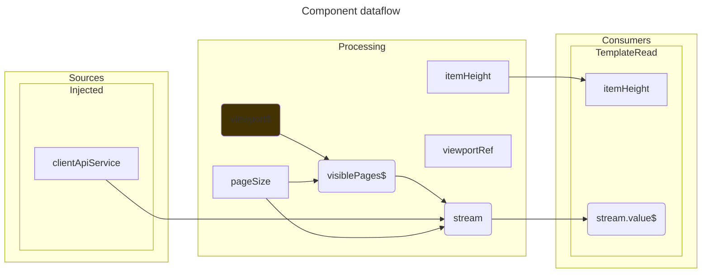
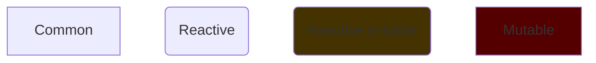

# virtual-scroll.component

```mermaid
---
title: Component dataflow
---
graph LR
    subgraph Sources
        subgraph Injected
            direction LR
            Source_clientApiService["
                clientApiService
            "]
        end
    end
    subgraph Processing
        Processing_viewport$("
            viewport$
        ")
        Processing_pageSize["
            pageSize
        "]
        Processing_itemHeight["
            itemHeight
        "]
        Processing_visiblePages$("
            visiblePages$
        ")
        Processing_stream("
            stream
        ")
        Processing_viewportRef["
            viewportRef
        "]
    end
    subgraph Consumers
        subgraph TemplateRead
            direction LR
            Consumer_itemHeight["
                itemHeight
            "]
            Consumer_stream.value$("
                stream.value$
            ")
        end
    end
    Sources ~~~ Processing
    Processing ~~~ Consumers
    Processing_viewport$ --> Processing_visiblePages$
    Processing_pageSize --> Processing_visiblePages$
    Processing_visiblePages$ --> Processing_stream
    Source_clientApiService --> Processing_stream
    Processing_pageSize --> Processing_stream
    Processing_itemHeight --> Consumer_itemHeight
    Processing_stream --> Consumer_stream.value$
    style Processing_viewport$ fill:#430

```

## Legend

```mermaid

graph TB
  Common["Common"]
  Reactive("Reactive")
  Reactive_writable("Reactive writable")
  Mutable["Mutable"]

  style Mutable fill:#500  
  style Reactive_writable fill:#430
```
