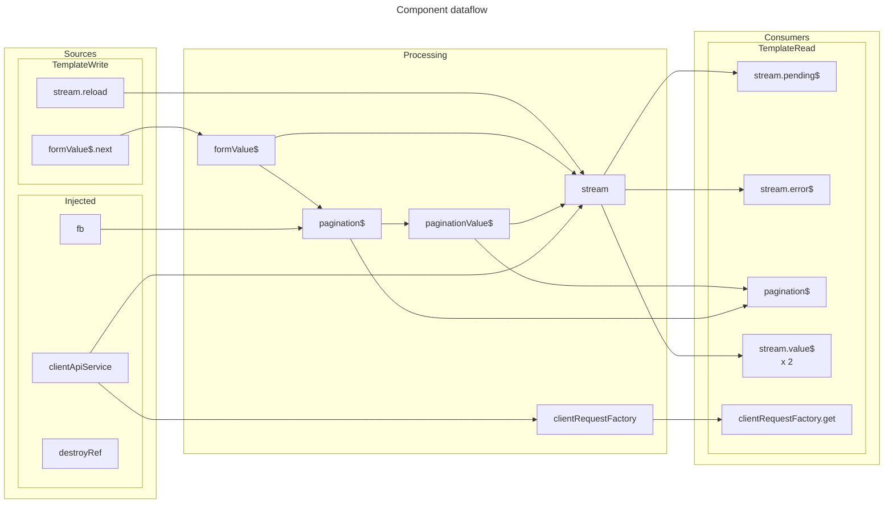

# with-collapse.component

```mermaid
---
title: Component dataflow
---
graph LR
    subgraph Sources
        subgraph Injected
            Source_fb["
                fb
            "]
            Source_clientApiService["
                clientApiService
            "]
            Source_destroyRef["
                destroyRef
            "]
        end
        subgraph TemplateWrite
            Source_formValue$.next["
                formValue$.next
            "]
            Source_stream.reload["
                stream.reload
            "]
        end
    end
    subgraph Processing
        Processing_formValue$["
            formValue$
        "]
        Processing_pagination$["
            pagination$
        "]
        Processing_paginationValue$["
            paginationValue$
        "]
        Processing_stream["
            stream
        "]
        Processing_clientRequestFactory["
            clientRequestFactory
        "]
    end
    subgraph Consumers
        subgraph TemplateRead
            Consumer_stream.pending$["
                stream.pending$
            "]
            Consumer_stream.error$["
                stream.error$
            "]
            Consumer_pagination$["
                pagination$
            "]
            Consumer_stream.value$["
                stream.value$
x            2
            "]
            Consumer_clientRequestFactory.get["
                clientRequestFactory.get
            "]
        end
    end
    Sources ~~~ Processing
    Processing ~~~ Consumers
    Source_formValue$.next --> Processing_formValue$
    Source_stream.reload --> Processing_stream
    Processing_formValue$ --> Processing_pagination$
    Source_fb --> Processing_pagination$
    Processing_pagination$ --> Processing_paginationValue$
    Processing_paginationValue$ --> Consumer_pagination$
    Processing_formValue$ --> Processing_stream
    Processing_paginationValue$ --> Processing_stream
    Source_clientApiService --> Processing_stream
    Source_clientApiService --> Processing_clientRequestFactory
    Processing_stream --> Consumer_stream.pending$
    Processing_stream --> Consumer_stream.error$
    Processing_pagination$ --> Consumer_pagination$
    Processing_stream --> Consumer_stream.value$
    Processing_clientRequestFactory --> Consumer_clientRequestFactory.get

```

